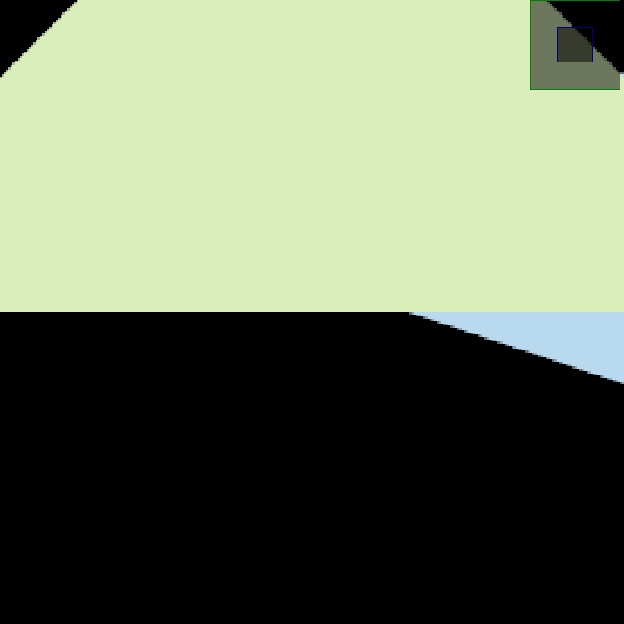

## Assignment 2

在作业一的基础上完成: 

**基础部分**

- 创建bounding box

  ```cpp
  const float INF = 1.0 * 0x3f3f3f3f;
  float lf = INF, rt = -INF, bt = INF, tp = -INF; 
  for(int i=0;i<3;i++){
      lf = std::min(lf, v[i].x());
      rt = std::max(rt, v[i].x());
      bt = std::min(bt, v[i].y());
      tp = std::max(tp, v[i].y());
  }
  ```

- 判断点三角形内

  ```cpp
  static bool insideTriangle(float x, float y, const Vector3f* _v)
  {   
      float cnt = 0;
      for(int i=0;i<3;i++){
          const float x1 = x - _v[i].x();
          const float x2 = x - _v[(i+1)%3].x();
          const float y1 = y - _v[i].y();
          const float y2 = y - _v[(i+1)%3].y();
          const float v = x1 * y2 - x2 * y1;
          if(v != 0 && v * cnt >= 0) cnt += v;
          else if(v != 0)return false;
      }
      return true;
  }
  ```

- 维护depth buffer

  ```cpp
  for(float x = std::floor(lf); x< std::ceil(rt);x+=1.0){
      for(float y = std::floor(bt); y< std::ceil(tp);y+=1.0){
          if(insideTriangle(x,y, t.v)){
              const float deep = depth_buf[get_index(x,y)];
              auto[alpha, beta, gamma] = computeBarycentric2D(x, y, t.v);
              float w_reciprocal = 1.0/(alpha / v[0].w() + beta / v[1].w() + gamma / v[2].w());
              float z_interpolated = alpha * v[0].z() / v[0].w() + beta * v[1].z() / v[1].w() + gamma * v[2].z() / v[2].w();
              z_interpolated *= w_reciprocal;
              if(z_interpolated < deep) {
                  depth_buf[get_index(x,y)] = z_interpolated;
                  set_pixel(Eigen::Vector3f(x,y,1), t.getColor());
              }
          }
      }
  }
  ```

**提高部分**

- 改为超采样

  ```cpp
  for(float x = std::floor(lf); x< std::ceil(rt);x+=1.0){
      for(float y = std::floor(bt); y< std::ceil(tp);y+=1.0){
          int idx = 0;
          for(float delx = 0.25; delx<=1.0; delx+=0.5){
              for(float dely = 0.25; dely<=1.0; dely+=0.5){
                  const float deep = depth_buf2[4 * get_index(x,y) + idx];
                  auto[alpha, beta, gamma] = computeBarycentric2D(x+delx, y+dely, t.v);
                  float w_reciprocal = 1.0/(alpha / v[0].w() + beta / v[1].w() + gamma / v[2].w());
                  float z_interpolated = alpha * v[0].z() / v[0].w() + beta * v[1].z() / v[1].w() + gamma * v[2].z() / v[2].w();
                  z_interpolated *= w_reciprocal;
                  if(z_interpolated < deep && insideTriangle(x+delx,y+dely, t.v)) {
                      depth_buf2[4 * get_index(x,y) + idx] = z_interpolated;
                      col_buf2[4 * get_index(x,y) + idx] = t.getColor();
                  }
                  ++idx;
              }
          }
          Eigen::Vector3f color = Eigen::Vector3f{0, 0, 0};
          for(int i=0;i<4;i++)color = color + col_buf2[4 * get_index(x,y) + i];
          set_pixel(Eigen::Vector3f(x,y,1), color/4);
      }
  }
  ```

**结果**

- 无超采样

  

- 无超采样(放大$256\%$)

  
  
- $2\times 2$超采样

  
  
- $2\times 2$超采样(放大$256\%$)

  