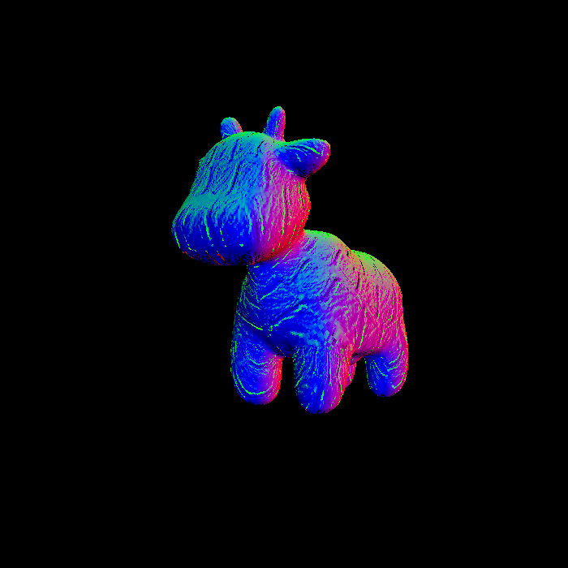

## Assignment 3

**基础部分**

- 创建bounding box, 维护深度缓存, 使用重心坐标+插值计算颜色, 法向量, 深度, 纹理坐标

- 复用之前的投影函数
- 补全布林冯模型
- 获取纹理贴图上的颜色, 并使用布林冯模型着色
- 计算凹凸贴图法向量并着色
- 计算位移贴图法向量并着色

**提高部分**

- 找其他模型渲染(使用的是`/models/Crate`)
- 将贴图尺寸从$1024\times 1024$缩小到$512\times 512$
- 实现双线性插值
- 使用双线性插值获取贴图颜色
- 对比两者区别: 在眼窝, 蹄子处过渡更加顺滑, 斑点被放大

**结果**

- 直接渲染

  

- 使用Blinn-Phong模型渲染

  
  
- 纹理贴图

  
  
- 凹凸贴图

  
  
- 位移贴图

  
  
- 渲染一个立方体-Blinn-Phong模型

  
  
- 渲染一个立方体-纹理贴图

  

- 不使用双线性插值渲染牛(使用$521\times 521$纹理)

  
  
- 使用双线性插值渲染牛(使用$521\times 521$纹理)

  

- 两者差别

  