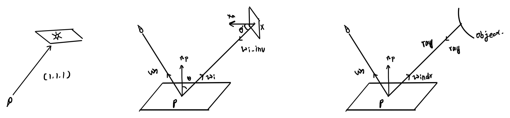
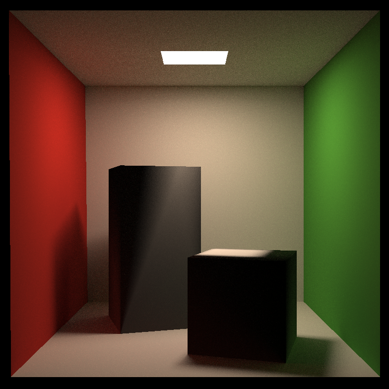
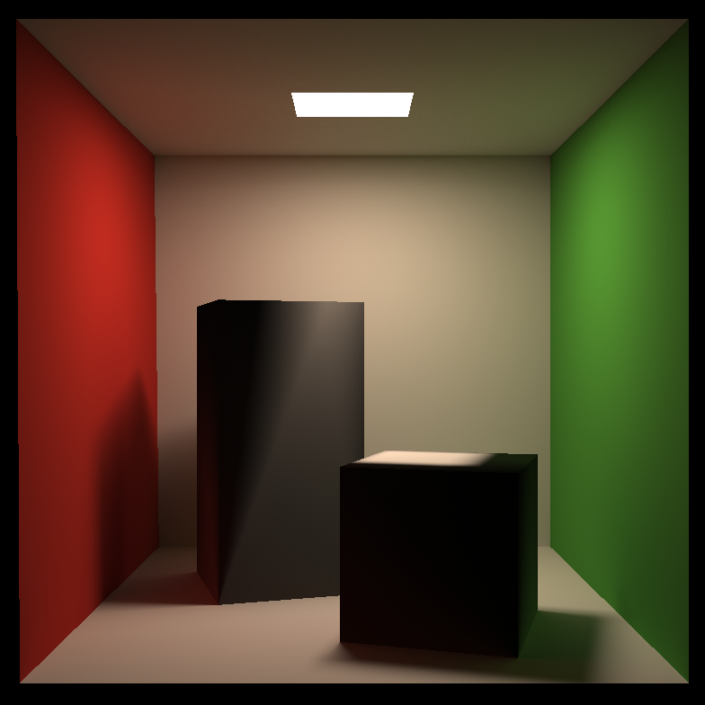

## Assignment 7

实现路径追踪与微表面

代码中Scene分类与参数解释

**结果**

- cornellbox光线追踪(SPP = 256, cost = 93min)

  

- cornellbox光线追踪(SPP = 1024, cost = 11h)

  

- cornellbox光线追踪(SPP = 16384, cost = 144h ETA)

  