# GAMES101-assignments-and-notes

🖼️GAMES101-现代计算机图形学入门作业与笔记

主讲: [闫令琪](https://sites.cs.ucsb.edu/~lingqi/)

课程主页: https://games-cn.org/intro-graphics/

B 站回放: https://www.bilibili.com/video/BV1X7411F744

### 笔记

- [x] [Lecture 1 概论](./note-lecture-01/README.md)
- [x] [Lecture 2 线性代数复习](./note-lecture-02/README.md)
- [x] [Lecture 3 Transformation - 模型变换](./note-lecture-03/README.md)
- [x] [Lecture 4 Transformation - 观测变换](./note-lecture-04/README.md)
- [x] [Lecture 5 Rasterization - 三角形](./note-lecture-05/README.md)
- [x] [Lecture 6 Rasterization - 反走样与深度测试](./note-lecture-06/README.md)
- [x] [Lecture 7 Shading - Blinn-Phong反射模型](./note-lecture-07/README.md)
- [x] [Lecture 8 Shading - 着色&管线&纹理](./note-lecture-08/README.md)
- [x] [Lecture 9 Shading - 纹理](./note-lecture-09/README.md)
- [x] [Lecture 10 Geometry - 几何表示](./note-lecture-10/README.md)
- [x] [Lecture 11 Geometry - 曲线与曲面](./note-lecture-11/README.md)
- [x] [Lecture 12 Geometry - 曲面操作与阴影](./note-lecture-12/README.md)
- [x] [Lecture 13 Ray Tracing - Whitted-Style光线追踪](./note-lecture-13/README.md)
- [x] [Lecture 14 Ray Tracing - 辐射度量学](./note-lecture-14/README.md)
- [x] [Lecture 15 Ray Tracing - 光线传播](./note-lecture-15/README.md)
- [x] [Lecture 16 Ray Tracing - 蒙特卡洛路径追踪](./note-lecture-16/README.md)
- [x] [Lecture 17 Materials and Appearances](./note-lecture-17/README.md)
- [x] [Lecture 18 Materials and Appearances](./note-lecture-18/README.md)
- [x] [Lecture 19 Cameras Lenses](./note-lecture-19/README.md)
- [x] [Lecture 20 Light Fields, Color and Perception](./note-lecture-20/README.md)
- [x] [Lecture 21 Animation and Simulation](./note-lecture-21/README.md)
- [x] [Lecture 22 Animation and Simulation](./note-lecture-22/README.md)
- [x] [合并版](https://liukairui.me/article/GAMES-101现代计算机图形学入门笔记/)

### 作业

- [x] [Assignment 0 环境搭建](./Assignment0)

- [x] [Assignment 1 实现模型变换与投影变换](./Assignment1)

  - 绕$oz$旋转

    .gif>)

  - 绕$(1,1,1)/\sqrt{3}$旋转

    .gif>)

- [x] [Assignment 2 实现深度测试与超采样](./Assignment2)

  - 无超采样

    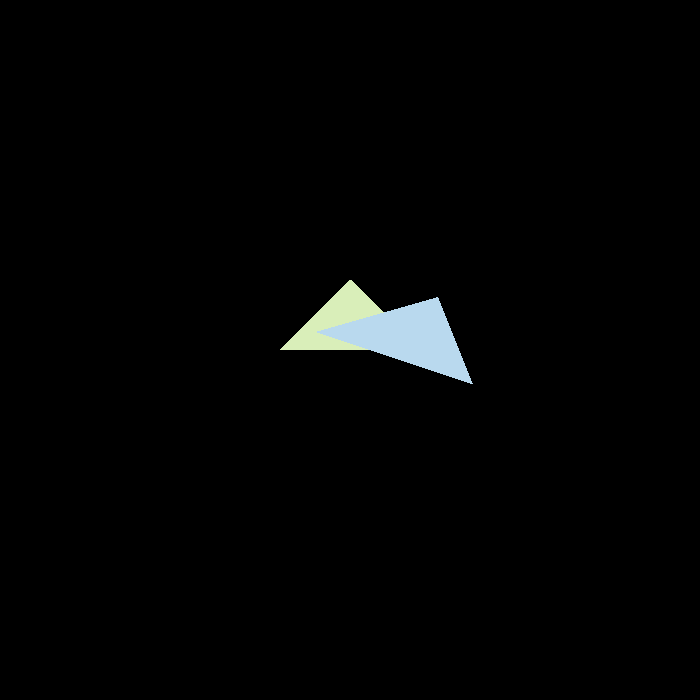

  - 无超采样(放大$256\%$)

    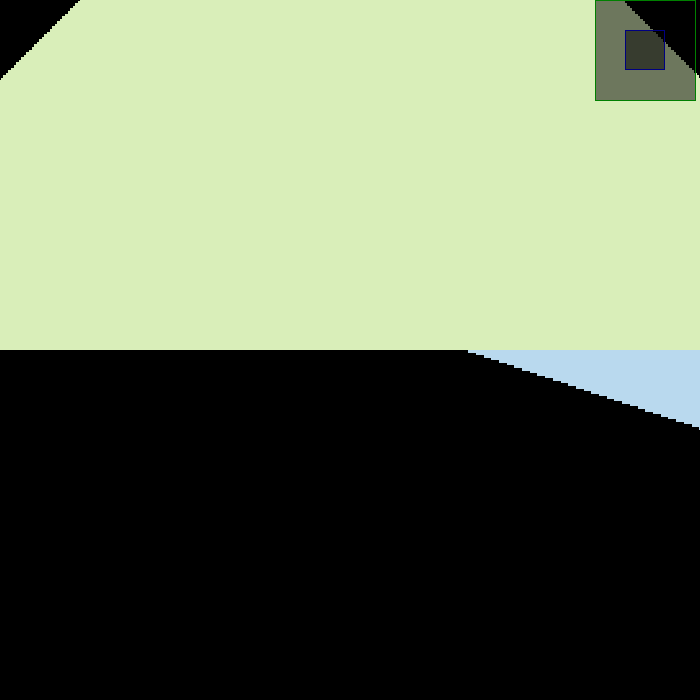

  - $2\times 2$超采样

    

  - $2\times 2$超采样(放大$256\%$)

    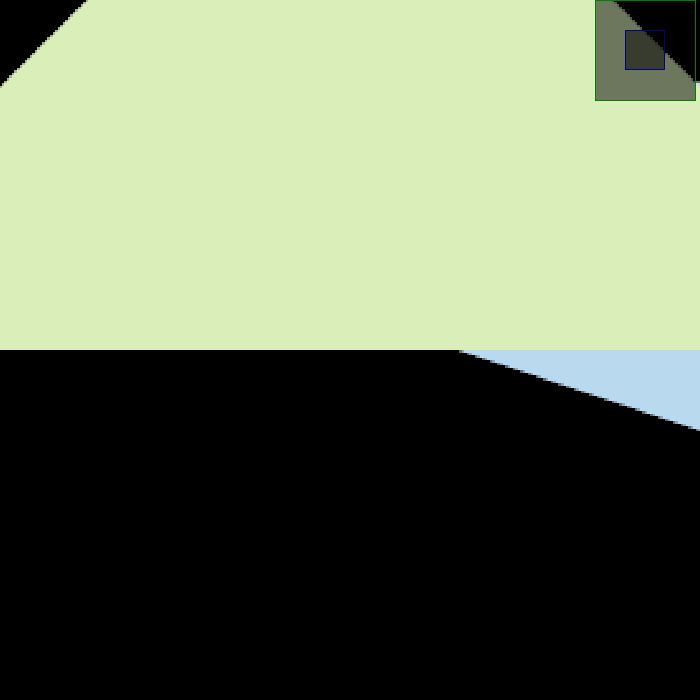

- [x] [Assignment 3 实现纹理](./Assignment3)

    - 直接渲染

      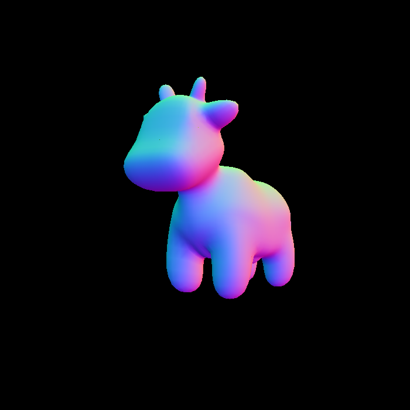

    - 使用Blinn-Phong模型渲染

      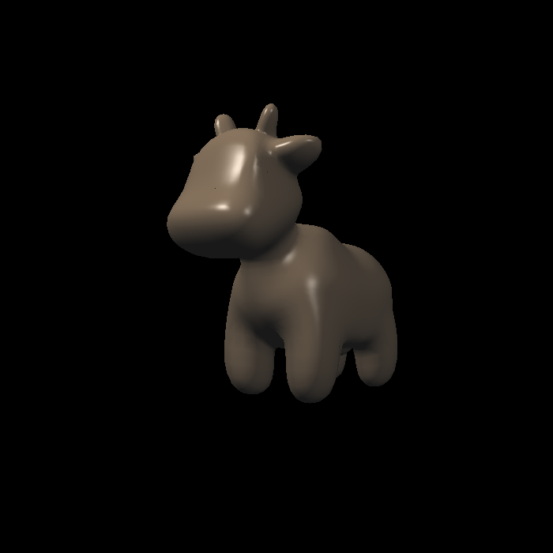

    - 纹理贴图

      

    - 凹凸贴图

      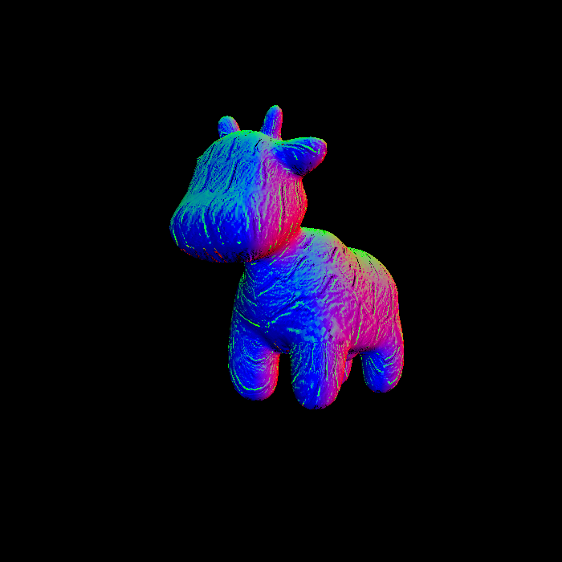

    - 位移贴图

      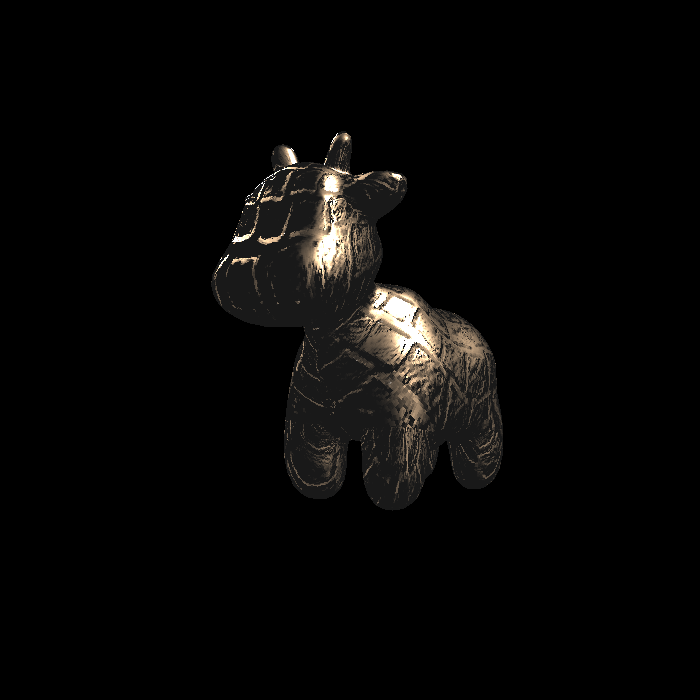

    - 渲染一个立方体-Blinn-Phong模型

      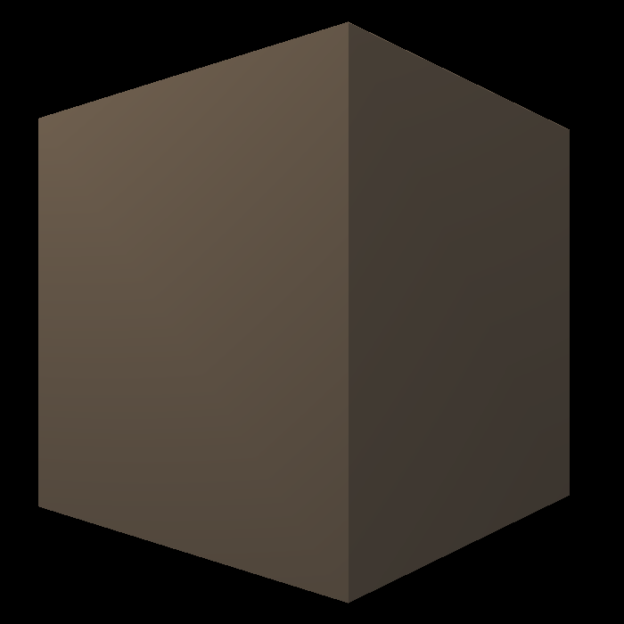

    - 渲染一个立方体-纹理贴图

      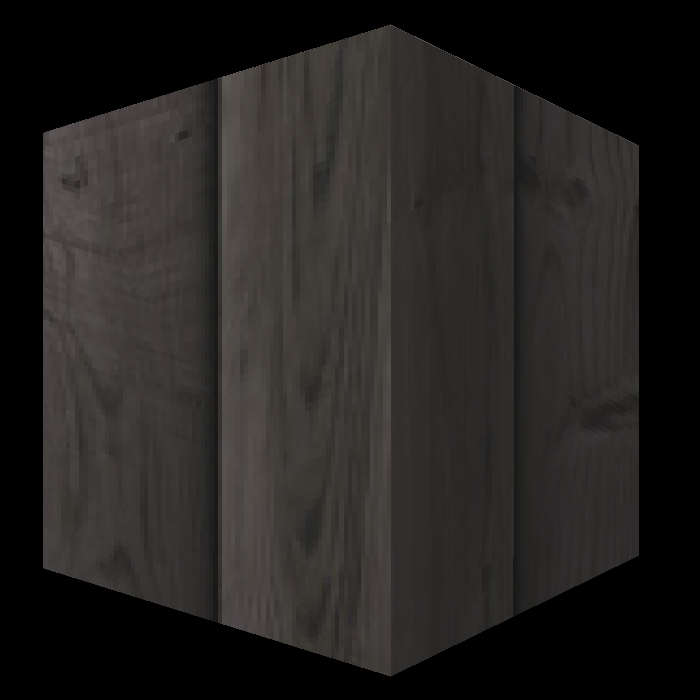

    - 不使用双线性插值渲染牛(使用$521\times 521$纹理)

      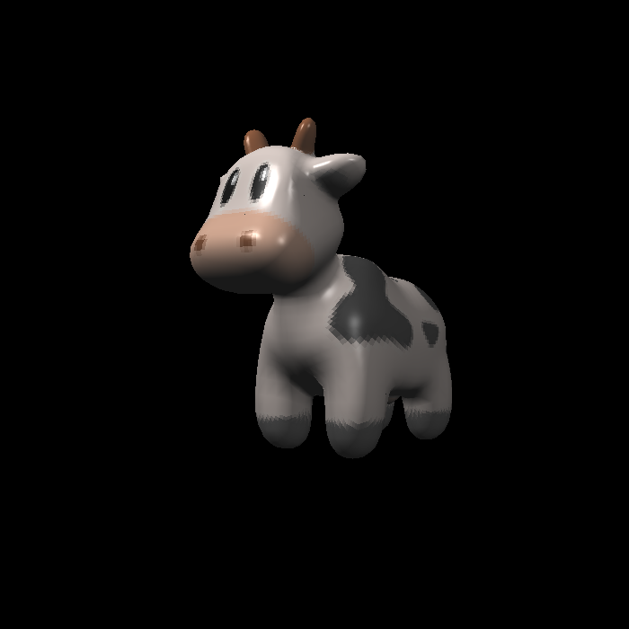

    - 使用双线性插值渲染牛(使用$521\times 521$纹理)

      

    - 两者差别

      

- [x] [Assignment 4](./Assignment4)

    - 贝塞尔曲线多项式计算与模拟结果对比

      

    - 加入反走样后效果(上到下: 反走样-模拟实现-函数实现)

      

- [x] [Assignment 5](./Assignment5)

    - Prime Ray生成, Prime Ray与三角形相交检测

      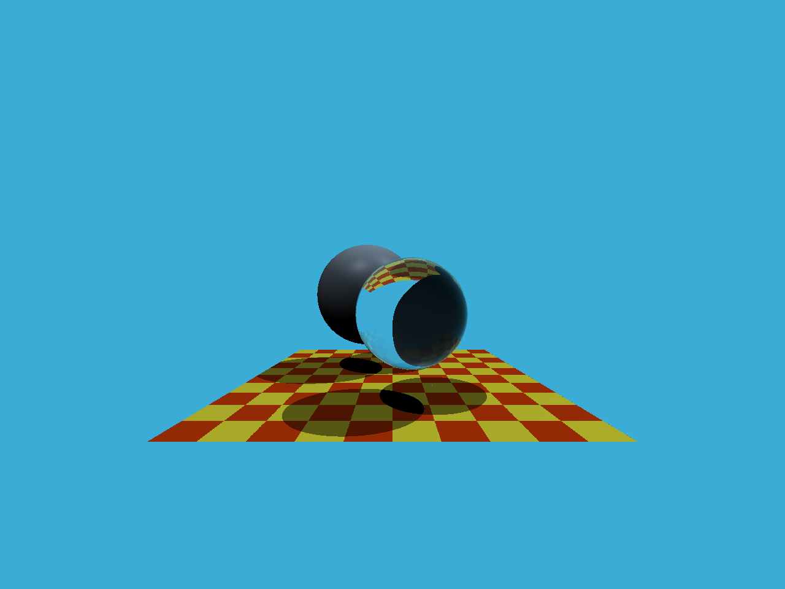

- [x] [Assignment 6](./Assignment6)

    - BVH加速结构(1467s)

      
      
    - SAH加速结构(1386s)

      

- [x] [Assignment 7](./Assignment7)

    - cornellbox光线追踪(SPP = 256, cost = 93min)

      

    - cornellbox光线追踪(SPP = 1024, cost = 11h)

      

    - cornellbox光线追踪(SPP = 16384, cost = 177h)

      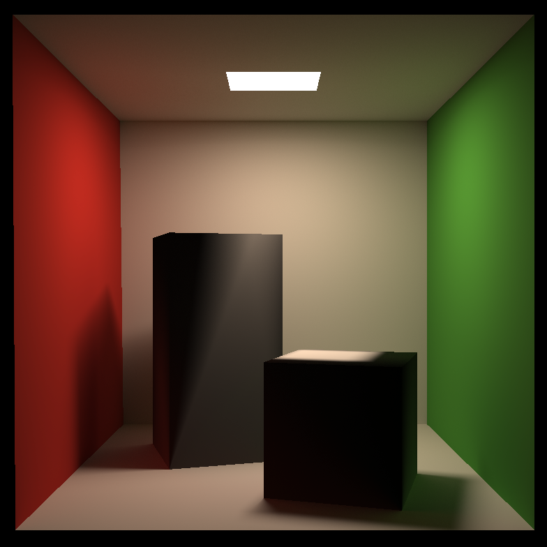

- [x] [Assignment 8](./Assignment8)

    - 显式欧拉方法, 不添加阻尼~~(闪电五连鞭)~~

      
      
    - 显式欧拉方法, 添加阻尼

      
      
    - 隐式欧拉方法与Verlet方法

      

- [x] [Final Project - 基于Three.js的Minecraft实现](https://github.com/KairuiLiu/ThreeCraft)
