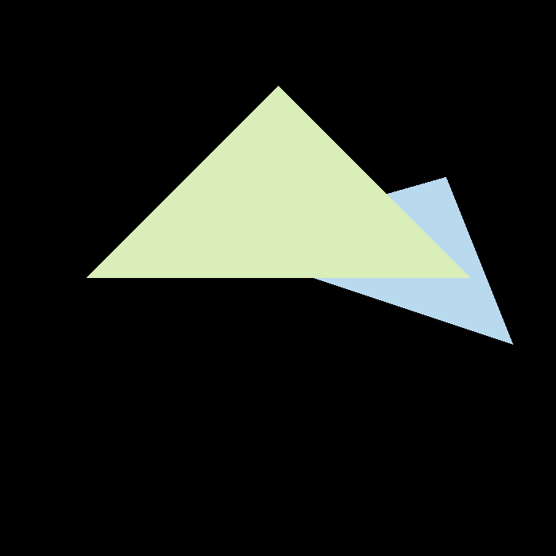

# GAMES101-assignments-and-notes
GAMES101-现代计算机图形学入门作业与笔记. 

主讲: 闫令琪

课程主页: https://games-cn.org/intro-graphics/

B站录屏课: https://www.bilibili.com/video/BV1X7411F744

### 作业

- [x] [Assignment 0 环境搭建](./Assignment0)

- [x] [Assignment 1 实现模型变换与投影变换](./Assignment1)

  - 绕$oz$旋转

    .gif)

  - 绕$(1,1,1)/\sqrt{3}$旋转

    .gif)

- [x] [Assignment 2 实现深度测试与超采样](./Assignment2)

  - 无超采样

    

  - 无超采样(放大$256\%$)

    
    
  - $2\times 2$超采样

    
    
  - $2\times 2$超采样(放大$256\%$)

    

- [ ] [Assignment 3 实现纹理](./Assignment3)

- [ ] [Assignment 4](./Assignment4)

- [ ] [Assignment 5](./Assignment5)

- [ ] [Assignment 6](./Assignment6)

- [ ] [Assignment 7](./Assignment7)

- [ ] [Assignment 8](./Assignment8)

### 笔记

- [x] [Lecture 1 概论](./note-lecture-01/README.md)
- [x] [Lecture 2 线性代数复习](./note-lecture-02/README.md)
- [x] [Lecture 3 Transformation - 模型变换](./note-lecture-03/README.md)
- [x] [Lecture 4 Transformation - 观测变换](./note-lecture-04/README.md)
- [x] [Lecture 5 Rasterization - 三角形](./note-lecture-05/README.md)
- [x] [Lecture 6 Rasterization - 反走样与深度测试](./note-lecture-06/README.md)
- [x] [Lecture 7 Shading - 着色](./note-lecture-07/README.md)
- [x] [Lecture 8 Shading - 着色&管线&纹理](./note-lecture-08/README.md)
- [x] [Lecture 9 Shading - 纹理](./note-lecture-09/README.md)
- [ ] [Lecture 10 Geometry](./note-lecture-10/README.md)
- [ ] [Lecture 11](./note-lecture-11/README.md)
- [ ] [Lecture 12](./note-lecture-12/README.md)
- [ ] [Lecture 13](./note-lecture-13/README.md)
- [ ] [Lecture 14](./note-lecture-14/README.md)
- [ ] [Lecture 15](./note-lecture-15/README.md)
- [ ] [Lecture 16](./note-lecture-16/README.md)
- [ ] [Lecture 17](./note-lecture-17/README.md)
- [ ] [Lecture 18](./note-lecture-18/README.md)
- [ ] [Lecture 19](./note-lecture-19/README.md)
- [ ] [Lecture 20](./note-lecture-20/README.md)
- [ ] [Lecture 21](./note-lecture-21/README.md)
- [ ] [Lecture 22](./note-lecture-22/README.md)

