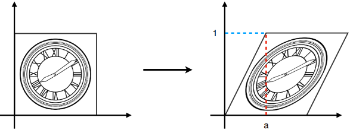
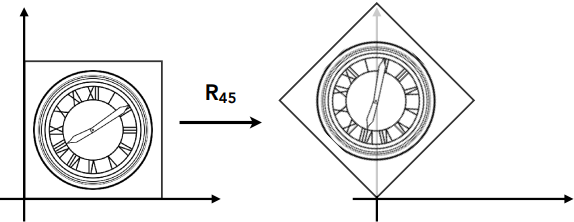
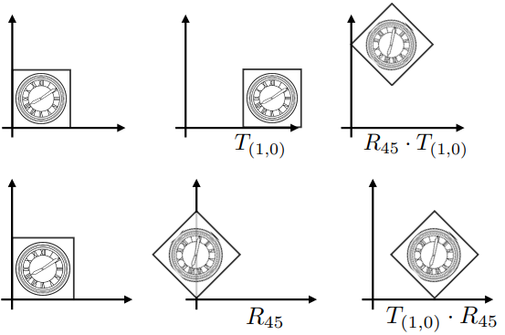

## Lecture 3 Transformation -模型变换

两种变换:

- 模型变换: 模型变(仿射变换)
- 视图变换: 摄像机变(投影, 3D转2D...)

### 二维变换

就是利用矩阵将每个点进行线性变换, 做变换相当于求解矩阵, 也就是用n个点求一个n元一次方程. 注意, 所有的变换都默认基于原点

- 缩放(Scale)

  将图像缩放$S_{a,b}$倍相当于将每个点$x \to x\times a, y \to y\times b$, 可以用矩阵简单描述变换
  $$
  \left[
  \begin{matrix}
  x'\\y'
  \end{matrix}
  \right]=\left[
  \begin{matrix}
  s_x&0\\0&s_y
  \end{matrix}
  \right]\left[
  \begin{matrix}
  x\\y
  \end{matrix}
  \right]
  $$
  图形关于$oy$对称就相当于是缩放$S_{-1,1}$

- 切变(Shear)

  大概长这样

  

  不知道如何变换的时候就列n元一次方程, 首先发现$y$是不变的, 就看$x$, 找$(1,0)\to(1,0)$, $(0,1)\to(a,1)$
  $$
  \left\{
  \begin{align}
  1 = 1k_x + 0k_y\\
  a = 0k_x + 1k_y
  \end{align}
  \right.
  $$

  很容易推算出$k_y = a, k_x = 1$, 于是得到矩阵
  $$
  \left[
  \begin{matrix}
  x'\\y'
  \end{matrix}
  \right]=\left[
  \begin{matrix}
  1&a\\0&1
  \end{matrix}
  \right]\left[
  \begin{matrix}
  x\\y
  \end{matrix}
  \right]
  $$

- 旋转(Rotate)

  默认旋转基于原点, 以逆时针为正方向. 使用$R_\theta$表示旋转了$\theta$

  

  假设旋转了$\theta$只需要找两个特殊点就可以求得矩阵, 这里采用$(1,0)\to(\cos\theta, \sin\theta)$与$(0,1)\to(-\sin\theta, \cos\theta)$方便消元
  $$
  \left\{\begin{align}
  (\cos\theta, \sin\theta)^T = (k_{xx}\times1+k_{xy}\times 0, k_{yx}\times1+k_{yy}\times 0)^T \\
  (-\sin\theta, \cos\theta)^T = (k_{xx}\times0+k_{xy}\times 1, k_{yx}\times0+k_{yy}\times 1)^T
  \end{align}\right.
  $$
  于是得到旋转矩阵
  $$
  \left[
  \begin{matrix}
  x'\\y'
  \end{matrix}
  \right]=\left[
  \begin{matrix}
  \cos\theta&-\sin\theta\\ \sin\theta&\cos\theta
  \end{matrix}
  \right]\left[
  \begin{matrix}
  x\\y
  \end{matrix}
  \right]
  $$

- 平移(Translation)

  用$T_{tx,ty}$描述将点平移$(t_x, t_y)$. 平移不属于上述线性变换, 没法用二阶矩阵乘法描述这种变换, 可以采用如下方法表示
  $$
  \left[
  \begin{matrix}
  x'\\y'
  \end{matrix}
  \right]=\left[
  \begin{matrix}
  1&0\\0&1
  \end{matrix}
  \right]\left[
  \begin{matrix}
  x\\y
  \end{matrix}
  \right]+\left[
  \begin{matrix}
  t_x\\t_y
  \end{matrix}
  \right]
  $$
  我们希望将线性变换与平移用一个统一的方式表现出来. 于是想到了使用**齐次坐标**(Homogeneous Coordinates)表示法, 为将每个点/向量增加一维

  - 点: $(x,y)^T \to (x,y,1)^T$
  - 向量: $(x,y)^T \to (x,y,0)^T$

  用第三维$w$为非$0$表示点, $w=0$表示向量. $w\neq0$时的点$(x,y,w)^T$可以认为是$(x/w, y/w, 1)^T$. 两个点相减就是向量(所以向量$w = 0$), 看起来这种表示方法比较符合数学定义

  - 向量加减还是向量: $(x_1,y_1,0)\pm (x_2,y_2,0) = (x_1+x_2, y_1+y_2, 0)$
  - 点减点是向量: $(x_1,y_1,1)- (x_2,y_2,1) = (x_1-x_2, y_1-y_2, 0)$
  - 点加点是两点的中点: $(x_1,y_1,1)+ (x_2,y_2,1) = (x_1+x_2, y_1+y_2, 2) = (\frac{x_1+x_2}{2}, \frac{y_1+y_2}{2}, 1)$

  平移$T_{tx,ty}$可以写作
  $$
  \left[
  \begin{matrix}
  x'\\y'\\1
  \end{matrix}
  \right]=\left[
  \begin{matrix}
  1&0&t_x\\0&1&t_y\\0&0&1
  \end{matrix}
  \right]\left[
  \begin{matrix}
  x\\y\\1
  \end{matrix}
  \right]
  $$
  很容易理解, 第三列可以被认为是偏移量

  我们称旋转, 缩放, 切变, 平移为仿射变换, 所有仿射变换矩阵第三行均为$[0,0,1]$

- 矩阵乘法有结合律无交换律

  矩阵满足结合率, 例如我们先用一个旋转的矩阵$M_R$再用一个缩放矩阵$M_S$, 处理$P$, 我们可以写$P' = M_S (M_R P)$, 利用矩阵乘法结合律, 也可以写作$P' = (M_S M_R) P$

  对于如下矩阵
  $$
  \left[
  \begin{matrix}
  x'\\y'\\1
  \end{matrix}
  \right]=\left[
  \begin{matrix}
  \cos\theta&-\sin\theta&t_x\\ \sin\theta&\cos\theta&t_y\\0&0&1
  \end{matrix}
  \right]\left[
  \begin{matrix}
  x\\y\\1
  \end{matrix}
  \right]
  $$
  我们知道他即应用了旋转又应用了平移. 我们定义的旋转是基于原点的, 此时旋转与平移的顺序会影响成像

  

  模拟一下先旋转后平移与先平移后旋转可以轻松得到这个矩阵是先旋转后平移的. 我们可以得, 用同一个矩阵表示线性变换与平移时应该**先线性后平移**

- 逆矩阵

  在线性代数中若$M N = I$则$N, M$互为逆矩阵. 在线性变换中, 一个变换矩阵的逆矩阵$M^{-1}$做与变换矩阵$M$完全相反的事情(例如$M$是旋转$45^\circ$平移$(1,2)$, $M^{-1}$则是平移$(-1,-2)$旋转$-45^\circ$). 补充: 旋转矩阵是正交矩阵, 即旋转矩阵的转置就是他的逆矩阵

### 三维变换

三维变换可以用二维变换类比得到, 只是三维的向量是$(x,y,z,0)^T$, 三维的点是$(x,y,z,1)^T$或$(x,y,z,w)^T = (x/w,y/w,z/w,1)^T$, 三维变换矩阵是四阶矩阵

- 缩放
  $$
  S(s_x, s_y, s_z) = \left(\begin{matrix}
  s_x&0&0&0\\0&s_y&0&0\\0&0&s_z&0\\0&0&0&1
  \end{matrix}\right)
  $$

- 平移
  $$
  T(t_x, t_y, t_z) = \left(\begin{matrix}
  1&0&0&t_x\\0&1&0&t_y\\0&0&1&t_z\\0&0&0&1
  \end{matrix}\right)
  $$

- 旋转比较麻烦

  **绕坐标轴旋转**

  - 关于$ox$转$\alpha$
    $$
    R_x(\alpha) =\left(\begin{matrix}
    1&0&0&0\\0&\cos\alpha&-\sin\alpha&0\\0&\sin\alpha&\cos\alpha&0\\0&0&0&1
    \end{matrix}\right)
    $$
  
  - 关于$oz$转$\alpha$
    $$
    R_z(\alpha) =\left(\begin{matrix}
    \cos\alpha&-\sin\alpha&0&0\\
    \sin\alpha&\cos\alpha&0&0\\
    0&0&1&0\\
    0&0&0&1\\
    \end{matrix}\right)
    $$
    
   - 关于$oy$转$\alpha$
  $$
  R_y(\alpha) =\left(\begin{matrix}
  \cos\alpha&0&\sin\alpha&0\\0&1&0&0\\ -\sin\alpha&0&\cos\alpha&0\\0&0&0&1
    \end{matrix}\right)
  $$
  
  关于$oy$旋转矩阵的负号位置看起来有点怪? 其实没问题, 绕$ox$转我们用$yz$, 绕$oz$转我们用$zy$,  绕$oy$转我们用$zx$都是按照右手系顺序转的. 
  
  **绕任意过原点向量旋转**
  
  人们通过飞机可以做出任意姿态类比认为任意旋转姿态都可以由绕$ox, oy, oz$旋转得来. 于是绕任意过原点轴旋转可以分解为分别绕$ox, oy, oz$旋转
  $$
  R_{x,y,z}(\alpha, \beta, \gamma) = R_{x}(\alpha)R_{y}(\beta)R_{z}(\gamma)
  $$
  也有现成的罗德里格旋转公式(Rodrigues' rotation formula)计算绕任意过原点向量($n$)旋转公式
  $$
  R(\bold{n},\alpha) = \cos(\alpha)\bold{I} + (1-\cos(\alpha))\bold{nn}^T+\sin(\alpha)\left(\begin{matrix}
  0&-n_z&n_y\\n_z&0&-n_x\\-n_y&n_x&0
  \end{matrix}\right)
  $$
  最后一个大矩阵就是叉积的矩阵表示
  
  **罗德里格旋转公式证明**
  
  - 向量叉积的几何意义
  
    设向量$\vec{k}$为垂直于向量$\vec{v}$的单位向量. 向量$\vec{v} \times \vec{k}$的方向垂直于$\vec{v}$, $\vec{k}$所成平面, 长度为$\|v\| \|k\| \sin 90^\circ = \|v\|$, 可以理解成$\vec{v} \times \vec{k}$是$\vec{v}$绕$\vec{k}$旋转$90^\circ$
  
  - 向量分解
  
    考虑$v\in R^3$的三维旋转问题，旋转轴$k$是单位向量，旋转角为$θ$，旋转后向量为$v_{rot}$, 向量$v$可以分解为平行于$k$的分量$v_\parallel$和正交于$k$的分量$v_\perp$, 显然有$v = v_\parallel + v_\perp$, 如图:
  
    
  
    尝试表示$v_\parallel$与$v_\perp$, 有
    $$
    v_\parallel = (v\cdot k)k \\
    v_\perp = v - v_\parallel = v-(k\cdot v)k = -k\times (k\times v)
    $$
    其中$v_\perp$的最后一步推导如下
  
    
  
    首先找得到$v$, $k$, 可以看到$k\times v$长度为$\|v\| \sin(<k,v>)$, 方向与$k, v$所在平面垂直, $k\times (k\times v)$长度为$\|v\|$, 方向与$k, (k\times v)$所在平面垂直, 此时$k, k\times v, k\times(k\times v)$两两垂直, 相当于我们在在$k, v$所在平面上建立了坐标系. $v_\perp$与$k\times (k\times v)$平行反向, 大小为$\|v\| \sin(<k,v>)$, 也就是$-k\times (k\times v)$
  
    再看$v$与$v_{rot}$, 可以看到两个向量都被分解为了平行与垂直向量. 在旋转中, $v_\parallel$不变, $v_\perp$发生了$\theta$角旋转, 即 $v_{\perp rot} = v_\perp\cos\theta+(k\times v)\sin\theta $
    $$
    \begin{align}
    v_{rot} &= v_{\parallel rot} + v_{\perp rot}\\
    &= v_\parallel + v_\perp\cos\theta+(k\times v)\sin\theta\\
    &= v_\parallel + (v-v_\parallel)\cos\theta+(k\times v)\sin\theta \\
    &= \cos\theta v + (1-\cos\theta)v_\parallel + \sin\theta k\times v\\
    &= \cos\theta v + (1-\cos\theta)(k\cdot v)k+\sin\theta k\times v\\
    \end{align}
    $$
    整理成矩阵形式就是
    $$
    v_{rot} = R(\bold{n},\alpha) v
    $$
  
    $$
    R(\bold{k},\alpha) = \cos(\alpha)\bold{I} + (1-\cos(\alpha))\bold{kk}^T+\sin(\alpha)\left(\begin{matrix}
    0&-k_z&k_y\\k_z&0&-k_x\\-k_y&k_x&0
    \end{matrix}\right)
    $$
  
  
