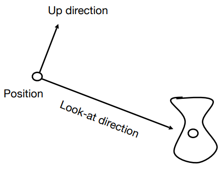
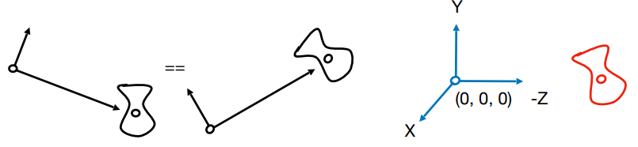
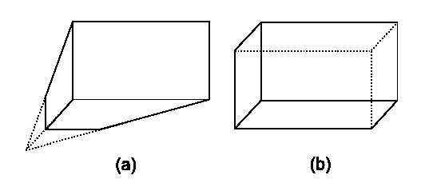
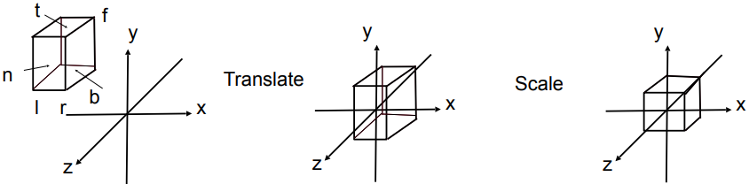
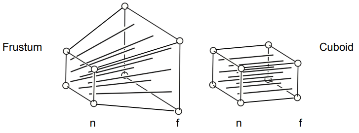
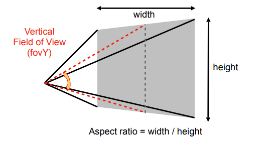
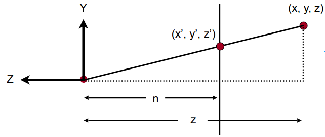

## Lecture 4 Transformation - 观测变换

观测变换的目的是将三维空间中的物体变为二维, 观测变换又分为视图变换与投影变换

变换有三步

- 模型变换(model transformation)是将模型放在一个需要的地方
- 观测变换的视图变换(view transformation)是将摄像机放在需要的地方
- 观测变换的投影变换(projection transformation)就是将三维场景投射到显示器上

将三个变换合称为MVP变换

### 视图变换

视图变换就是将相机放在想要放的地方, 描述相机位置应该有: 相机位置(Position)$\vec{e}$, 相机的观测方向(gaze direction)$\hat{g}$, 相机朝上方向(up direction)$\hat{t}$

当相机与观测物体同时移动但相对静止时观测的场景应该是不变的, 于是我们希望将相机放在一个固定位置, 只让场景动. 约定相机始终在原点, 看向$oz$负方向, $oy$为朝上方向

将相机从任意位置移动到原点只需做几次仿射变换

- 平移$(-x,-y,-z)$
- 将$\hat{g}$转动到$-oz$
- 将$\vec{t}$转动到$oy$
- 将$\hat{g} \times \vec{t}$转动到$ox$

将向量旋转到坐标轴不太好写, 我们可以先将坐标轴旋转到向量然后求逆矩阵(由于旋转矩阵是正交矩阵, 矩阵的转置就是逆矩阵), 最后得到
$$
\left[\begin{matrix}
x_{\hat{g}\times \hat{t}}&y_{\hat{g}\times \hat{t}}&z_{\hat{g}\times \hat{t}}&0\\x_{t}&y_{t}&z_{t}&0\\x_{-g}&y_{-g}&z_{-g}&0\\0&0&0&1\\
\end{matrix}\right]
\left[\begin{matrix}
1&0&0&-x_e\\0&1&0&-y_e\\0&0&1&-z_e\\0&0&0&1\\
\end{matrix}\right]
$$

### 投影变换

投影就是将3D转为2D的过程, 分为正交投影(Orthographic projection)与透视投影(Perspective projection)

- 透视投影(左): 认为摄像机是一个点, 考虑人类视觉特性, 平行线可能不平行, 有近大远小效果.
- 正交投影(右): 认为摄像机是一个距离物体无限远, 按照物体本身属性投影, 平行线仍旧平行, 没有近大远小效果, 一般用于工程制图

**正交投影**

正交投影实现思路简单, 

- 将场景包裹在一个立方体中
- 将场景中心移动到原点
- 将立方体缩放到$[-1,1]^3$的立方体(canonical cube)中(非等比缩放) 
- 将所有点的$z$值设为0即可(忽略覆盖问题)

这里是在视图变换结束之后将场景移动到中心并缩放到正则立方体中, 不会影响摄像机位置, 后续会通过视口变换等方法解决平移与非等比缩放等带来位置的问题

定义远(f)近(n)左(l)右(r)上(t)下(b)容易得到变换矩阵
$$
M_{ortho} = 
\left[\begin{matrix}
\frac{2}{r-l}&0&0&0\\0&\frac{2}{t-b}&0&0\\0&0&\frac{2}{n-f}&0\\0&0&0&1
\end{matrix}\right]
\left[\begin{matrix}
1&0&0&-\frac{r+l}{2}\\0&1&0&-\frac{t+b}{2}\\0&0&1&-\frac{n+f}{2}\\0&0&0&1
\end{matrix}\right]
$$
**透视投影**

我们可以将需要描述的物体放在左边这样的视锥(Frustum)中, 可以这样理解视锥: 从摄像机(原点)处往外看, 可见范围就是一个锥体, 我们截出一个台出来, (当然, 这个棱台的边会汇聚到原点)

用如下的方法定义一个视锥: 视野的长宽比, 视野范围(水平/垂直可视角度)

- 宽高比: $Aspect = x_{right} / y_{top}$
- 垂直可视角: $\tan\frac{forY}{2} = \frac{y_{top}}{\|z_{near}\|}$

我们想要做的就是将这个椎体投影到屏幕上, 解决方法是**先将椎体"压"到右边的一个立方体(Cuboid)中, 然后再做正交投影**. 在变换过程中我们可以保证

- Near面是完全不变的. 
- 在"压"的过程中Far面上各个点的$z=f$(但这不意味着椎体内部点在压的过程中z值不变)
- 由于Frustum的轴心穿过$oz$, 所以Far面的中心仍然在$oz$轴上

需要做的就是求挤压矩阵$M_{persp\to ortho}$

从$ox$负方向看视锥

通过相似三角形可以轻松得到
$$
y' = \frac{n}{z}y
$$
类似的可以得到
$$
x' = \frac{n}{z}x
$$
得到了部分变换
$$
(x,y,z,1)^T \to (nx/z, ny/z, ?, 1)
$$
这里我们进行一个小的等价变换(以节省计算资源?)
$$
(x,y,z,1)^T \to (nx/z, ny/z, ?, 1) = (nx, ny, ?, z)
$$
就剩下$z$不知道怎么求了(也就是变换矩阵的第三行不知道是什么), 设其为$(a,b,c,d)$, 我们应该有$(a,b,c,d)^T(x,y,z,1) = z'z$

- 近平面上的点不变, 即: $z = n$时, $z' = z$, 即$x,y$应该与$z$无关, 即$a = b = 0$, 同时$c \times n + d = n^2$
- 远平面中心点不变, 即: $c\times f + d = f^2$

求得: $c = n+f, d = -nf$, 最后得到透视投影矩阵
$$
M_{persp\to ortho} = \left[\begin{matrix}n&0&0&0\\0&n&0&0\\0&0&n+f&-nf\\0&0&1&0\end{matrix}\right]
$$

