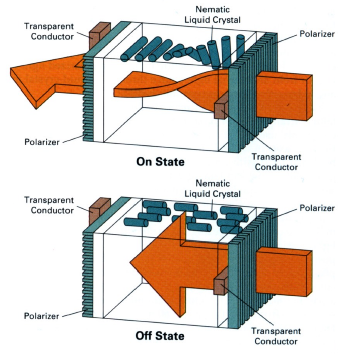
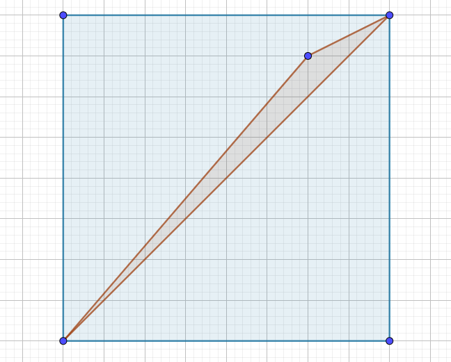
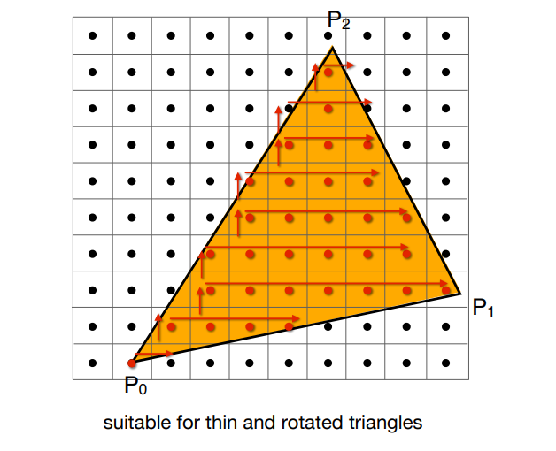
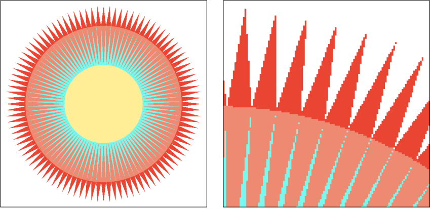

## Lecture 5 Rasterization - 三角形

完成变换之后, 我们将物体缩放到了一个$[-1,1]^3$的正则Cube中, 之后需要将其光栅化(Rasterize)到屏幕(Raster)上

### 光栅显示设备

- 激光切割机

- 示波器

- 阴极射线管(CRT): 通过两个偏转磁场将电子打在荧光屏上, 通过扫描的方式实现覆盖, 后又通过隔行扫描的方式减少时间开销, 但是在扫描运动场景时会造成画面撕裂(鬼影)

- 通用显示器(LCD/ LED/ OLED...): 将显存中区域映射到图像

- LCD显示器

  

  液晶显示器前后有两个垂直的光栅. 正常情况下只有波动方向相同的光才能通过光栅, 即不应该有光通过相互光栅, 液晶显示器中的液晶可以通过震动引导光改变波动方向从而操作需要显示的部分

- 墨水屏: 有黑白两种分别带电墨水, 通过加电改变两种颜色墨水朝向

### 光栅化

光栅化就是将三维图形显示到屏幕上的过程. 可以认为屏幕就是一个内存中的二维数组(左下角为$(0,0)$, 像素$(x,y)$的中心在$(x+0.5,y+0.5)$)

**将Cube缩放到屏幕(视口变换)**

忽略$z$, 将$[-1,1]$缩放到$[0, width]\times [0,height]$.
$$
M_{viewport} = \left[\begin{matrix}
\frac{width}{2}&0&0&\frac{width}{2}\\0&\frac{height}{2}&0&\frac{height}{2}\\0&0&1&0\\0&0&0&1\\
\end{matrix}\right]
$$
**使用三角形表述图像**

一般用三角形表述复杂的图像, 原因是

- 三角形只能构成一个平面(四边形就可以折叠成立体的)
- 不存在凹多边形, 容易判断点与三角形关系
- 只需要定义三角形顶点信息就可以在内部轻松插值
- 三角形可以表示任意多边形

**通过采样(simple)将三角形打碎在像素上**

采样就是将函数离散化的过程, 对于三角形光栅化来说就是询问每一个像素在不在三角形内

判断像素是否在三角形内就是通过叉积判断像素中心点与三角形关系

**通过Bounding Box缩小采样范围**

对每一个像素都采样消耗过大. 显然, 只有$[x_{min}, x_{max}]\times [y_{min}, y_{max}]$范围内的点才有可能落在三角形内, 所以只遍历这个区域. 我们称这样三个顶点的最大最小值围成的矩形为Bounding Box. 

Bounding Box也是有缺点的, 例如一些斜放的窄长三角形, Bounding Box会多算很多像素

我们可以优化一些特殊情况, 例如倾斜三角形可以从每行的一边开始从左到右采样

**锯齿(Jaggies) / 走样(asing)问题**

每个像素都有一定大小, 这导致我们的采样频率是一个常数, 采样频率过低时会出现走样问题

