## Lecture 6 光栅化- 反走样

**走样的原因**: 像素有一定尺寸, 采样频率不足

**常见走样**: 锯齿 / 摩尔纹 / 车轮效应(wagon wheel illusion)...

**采样频率带来走样的原因**: 

可以看到, 使用同样的采样频率采样低频信号时, 采样结果(蓝色虚线)可以基本还原原函数, 但采样高频信号时还原能力变差(没法恢复信息)

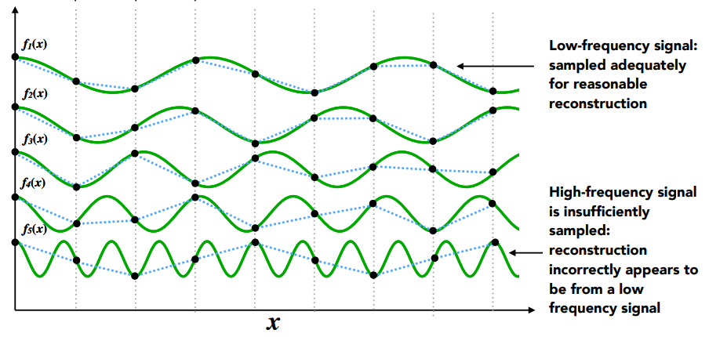

使用同样的采样频率采样蓝黑两个函数得到同样的结果, 我们无法通过采样结果区分他们, 这就是走样 

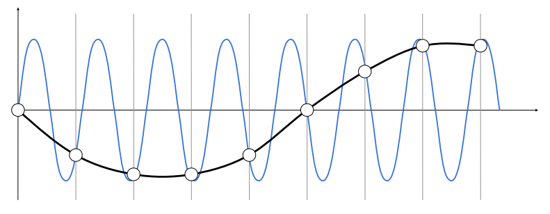

**解决方案**: 先过滤图像的高频部分再采样, 也就是先模糊再采样, 其有效的原因如下

- 可以通过傅立叶变换得到图片的频谱

  

  这样理解图像的频谱: 假设我们用灰度值作为$oz$轴, 我们可以在原图上得到一个三维坐标系. 对这个图做傅立叶变换, 即用波函数叠加逼近图像, 每个波函数大概是这样的

  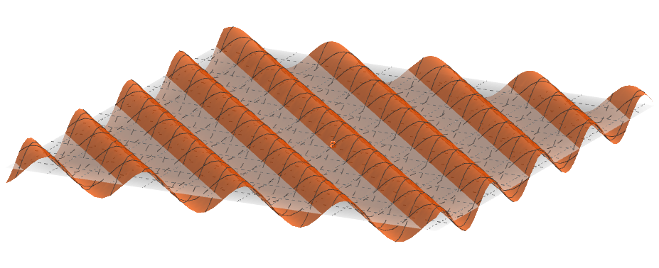

  他们叠加最后逼近图像, 例如

  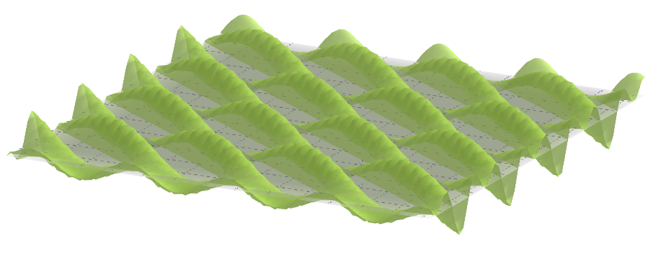

  我们需要在频谱图中描述这些三维波函数. 我们需要用频率$f$, 幅度$A$, 相位$\phi$描述二维波函数, 在三维中我们还要用方向$\vec{n}$描述波的运动方向. 在频谱图中, 我们用点到中心的距离描述频率$f$高低, 用点的亮度描述幅度$A$, 用中心到点的方向描述方向$\vec{n}$. 可以看到在右边频谱中, 大部分点在低频(大多自然图像都是这样的). 我们还可以看到中间有两条两线, 这是因为波函数的定义域是$\mathbb{R}^2$, 我们需要不断的将图像上下边, 左右边拼接在一起, 最后得到无限大的图片, 但是图片上下边, 左右边差距过大, 所以会出现高频. 

- 对频谱应用低通滤波器

  

  图像变模糊 (变化剧烈(边缘)的部分被抹去了)

- 对频谱应用高通滤波器

  

  边缘被提取了

- 我们希望去掉高频信号, 这样可以让采样的结果走样减少. 而去掉高频会让图像变模糊. 但是会有一些采样点出现颜色过渡

  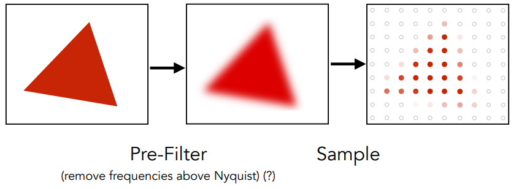

  我们可以采用对图像做卷积替代傅立叶变换-滤波-逆变换的方法让图像变模糊(在时域上做卷积相当于在频域上做乘积), 采用非常简单卷积方法$color[x,y] = \sum_{i=-1}^{i=1}\sum_{j=-1}^{j=1}color[x+i,y+j]/9$

**注意**: 先模糊再采样而不能先采样再模糊, 原因如下

- 采样相当于用狄卡拉梳状函数乘以时域上的函数, 相当于在频域上卷积, 最后得到了重复的一堆函数

  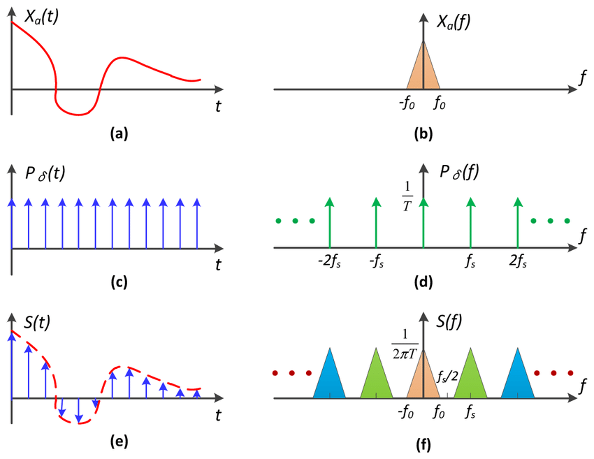

- 如果采样间隔过大, 就会造成重复函数在高频上的叠加, 产生走样

  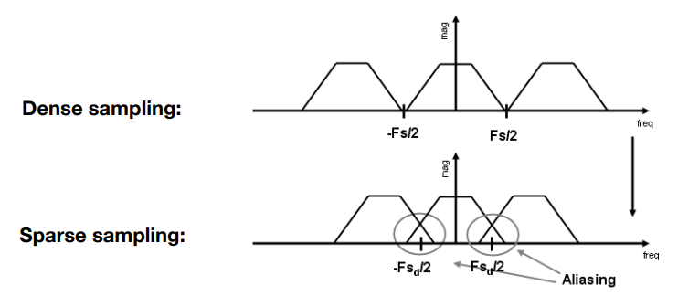

- 模糊操作相当于过滤掉了高频部分, 从而在采样时不产生叠加

  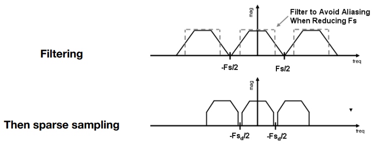

- 先采样后模糊相当于先发生了高频叠加, 然后载过滤掉一部分叠加部分, 所以效果不好

除了简单卷积, 我们可以通过提高采样率(超采样技术(Supersampling, MSAA))再求均值的方法让图像变模糊, 例如下面是一个$2\times 2$的MSAA

- 我们将一个像素点变为$2\times 2$个像素点, 用每个小像素点采样(计算是否在三角形内)

  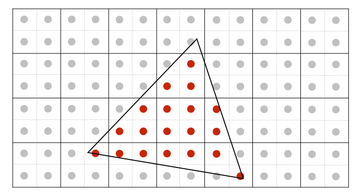

  - 然后对每个像素求平均

  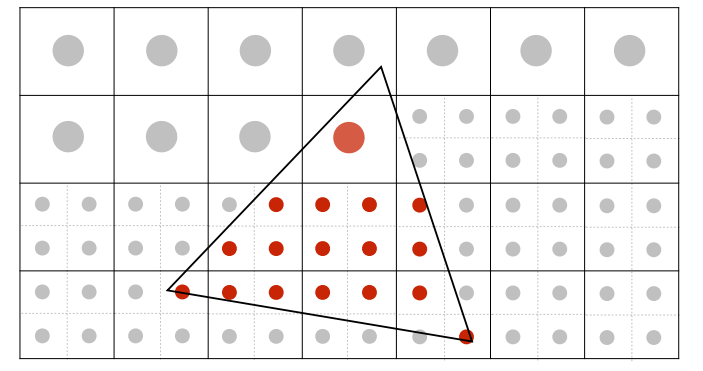

  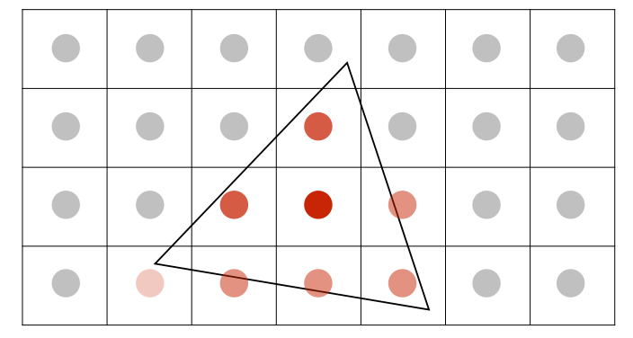

显然, $n\times n$的MSAA需要消耗直接采样$n^2$倍的时空, 在工业中, 我们可以重新定义小像素的排列位置实现小像素在像素间的复用

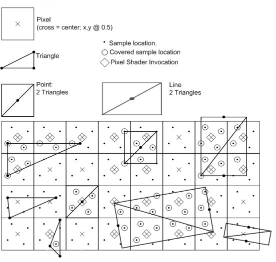

还有更多的反走样方法: 例如FXAA(先采样得到锯齿图, 然后匹配锯齿, 替换锯齿), TAA(与上下帧对对比判断点是否在三角形内)

