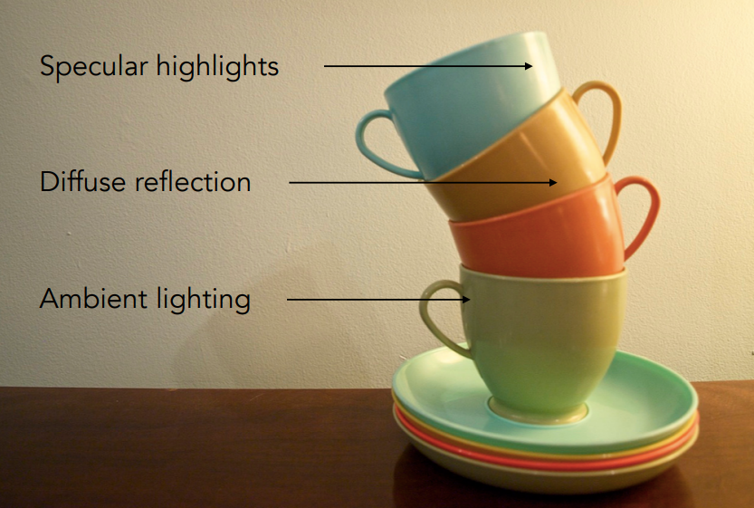
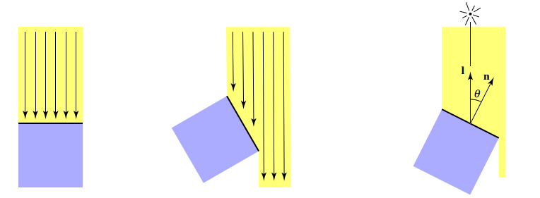
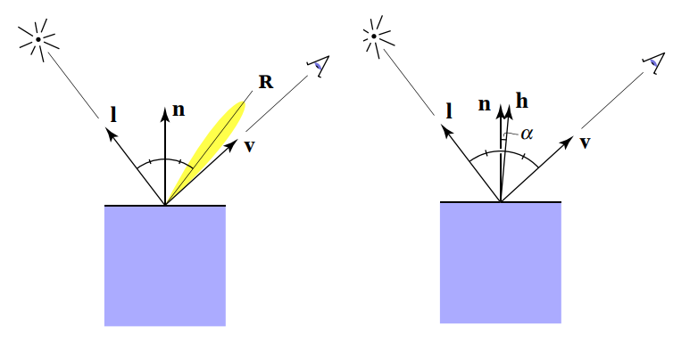
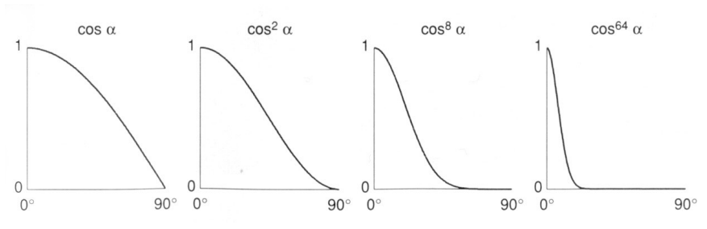

## Lecture 7 Shading

着色就是对不同的物体应用不同材质的过程

### Blinn-Phong 反射模型

布林冯反射模型是用来描述光在物体上反射的简单模型. Blinn-Phong模型是一个经验模型, 不考虑阴影, 不考虑光从反射点到观察者的能量衰减, 所以模型效果不一定好, 也不一定经得起推敲

Blinn-Phong模型将光在材质上的反射分为三个区域: 

- 高光部分(Specular highlights): 光线照到发生镜面反射部分
- 漫反射区(Diffuse reflection): 光线照到发生漫反射部分
- 环境光区(Ambient lighting): 光本身照不到, 但是被其他部分光反射照到, 假设任何一个点都可以接收到大小为常量的环境光

我们假设着色点(shading point, 就是反射点)所在的面是一个小平面, shading point到光源方向$l$, shading point到观察者方向$v$, shading point所在平面法线$n$, ($l, v, n$都是单位向量)

**生成漫反射**

- 同样的光打在**单位面积**物体上时, 光与物体成角度不同, 物体接收到的光不同

  

  可以得到物体接收到的光应该是入射光强的$\cos\theta$倍, 而$\cos\theta = l \cdot n$

- 光在空间中是以球形传播的. 假设光线从光源发射传播到了半径为$1$的球面上时, 单位面积上光能量为$I$. 那么当光线到达半径为$r$的球面上时, 单位面积上光能量为$I/r^2$

- 假设漫反射是向四面八方均匀反射的, 同时不考虑反射光的能量损耗
  $$
  L_d = k_d(I/r^2)\max(0,n\cdot l)
  $$
  这里的$\max$是为了防止点积小于0(shading point在没有被光照的那面, 同时我们不考虑透明物体)

  $k_d$是漫反射系数: 表示物体吸收射入光线的能力, 比如物体是白色, 那么$k_d=0$, 所有射入光线都会被反射. 物体是黑色, 那么$k_d=1$, 所有射入光线都会被吸收, 不发生反射(一点物理知识). 一般就用颜色代表$k_d$

**生成高光反射**

在简单物理模型中, 只有镜面反射只有在入射角等于观测角的时候才能看到. 但是我们认为只要观测角和反射角差在一定范围内就可以看到光线, 只不过光线强不不同罢了

如左图, 反射光为$R$, 在$R$附近都可以看到一定强度的反射光, 我们需要衡量$R$与$v$之间的角度差以计算光强度. 我们通过半程向量$h = \frac{l+v}{\|l+v\|}$的方法衡量. 最后表述方法是
$$
\begin{align}
L_s &= k_s(I/r^2)\max (0, \cos\alpha)^p\\
&= k_s(I/r^2)\max (0, n\cdot h)^p
\end{align}
$$
$\cos\alpha$看起来比较离谱, 只有当$\alpha \geq 90^\circ$时才看不到镜面反射..., 但即使$l = -v$时$\alpha$都不到$90^\circ$, 我们需要加一个高光系数$p$, 让$(\cos\alpha)^p$快速衰减到$0$, 一般设$p$为$100-200$(p.s. 为什么不用$<R,v>$而要用半程向量呢? 因为半程向量计算更快($R$不好算). 也有用$<R,v>$的模型, 叫Phong模型, Blinn-Phong模型是他的改进)

$k_s$为镜面反射系数, 按照漫反射的思路, 这里应该表示多少光被吸收, 但是在Blinn-Phong模型不考虑这个, 一般认为镜面反射会将光全部反射出去$k_s = 1$

**生成环境光**

环境光太难算了, 我们直接认为环境光为常量$I_a$, shading point上有环境光反射系数$k_a$
$$
L_a = k_a I_d
$$

最后得到布林冯模型
$$
L = k_aI_a + k_d(I/r^2)\max(0, n\cdot l)+k_s(I/r^2)\max(0,n\cdot h)^p
$$
