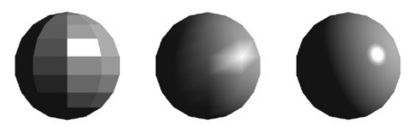
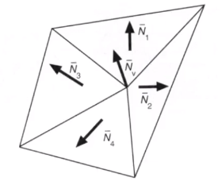
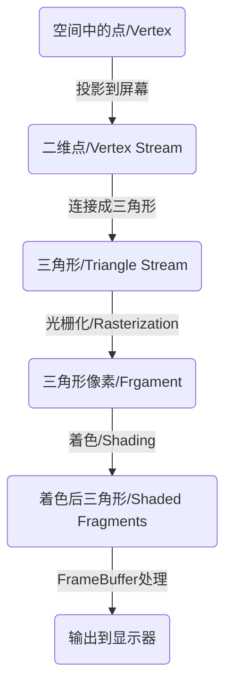
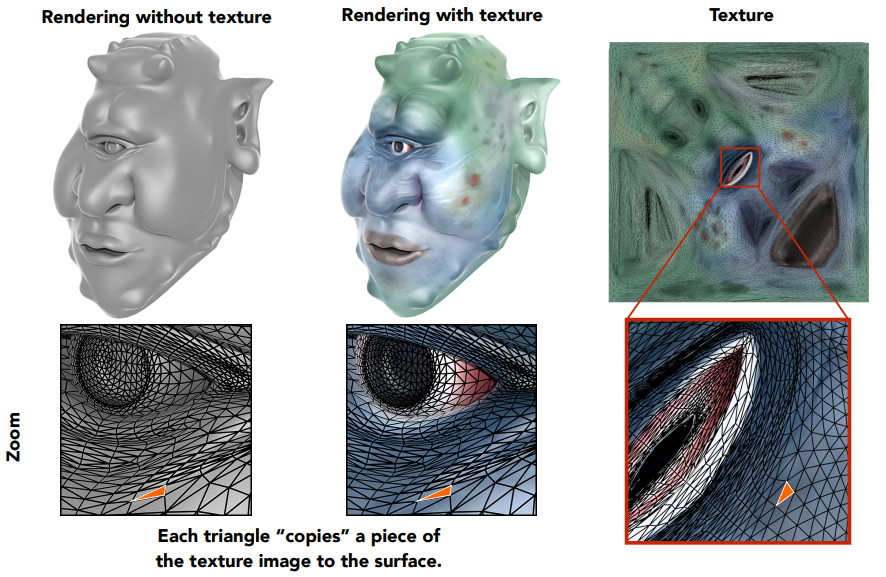
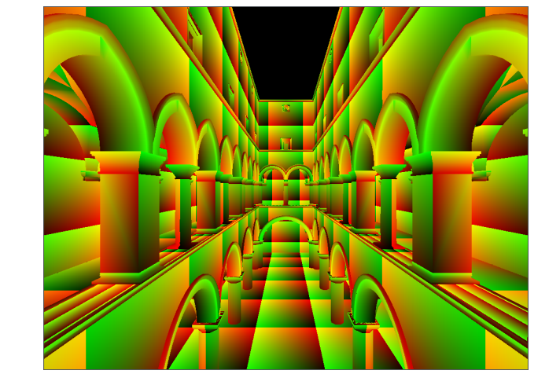

## Lecture 8 Shading - 着色&管线&纹理

**着色频率**

之前Shading是对某个点着色. 在渲染中我们可以将Shading应用于任何位置, 如: 三角形整个平面上 / 顶点上(内部插值) / 每个像素上. 分别对应下面三张图, 可以看到, 第二张图的在边上有明显的分异

- 应用在平面上(Flat Shading): 将着色应用于三角形面上, 整个三角形一个颜色, 我们通过三角形两边叉积求得法线

- 应用在顶点上(Gouraud Shading): 将着色应用于顶点上, 在顶点之间与三角形内部做插值. 计算顶点的发现比较困难, 我们可以计算顶点相邻的面, 根据相邻面的法线与相邻面的面积加权平均得到

  
  $$
  N_v = \frac{\sum_iN_i}{\|\sum_iN_i\|}
  $$
  叉积的结果与法线同向, 长度是面积, 正好就做了加权. 正常情况下, 我们的想法是加权后应该除以面积和$\sum_i\|N_i\|$来平均. 但是在这里老师用了$\|\sum_iN_i\|$, 因为我们已经通过面积加权的得到了方向, 现在只是想将这个超长向量化为单位向量, 所以直接除以模长就行, 不用除以每个的面积(用每个的$\sum_i\|N_i\|$求出来不一定是单位向量, 我们还要做归一化)

- 应用在像素上(Phone Shading): 先求三角形顶点的法线, 然后插值到每个像素上(注意插值后归一化), 再分别为每个像素着色

Gouraud Shading与Phone Shading都需要插值, 在三角形上可以使用重心坐标插值

**渲染管线**

渲染管线(Graphics Pipeline / Real-time Rending Pipeline): 将模型转为图像的全部过程就是渲染管线(中文看不懂也可以看到英文中的Pipeline), 也就是之前的一系列操作

可以看出, 其实三角形是我们虚拟出的概念, 实际上是不存在的

**纹理**

我们可以给三角形渲染上不同的材质/纹理(木头, 塑料...),纹理实际上就是一个二维数组, 里面存储的是每个点在布林冯模型中的反射系数/其他属性. 

我们将纹理定义在物体表面上(也就是一个二维平面), 为了让物体上的点与纹理可以一一对应, 我们想到了三角形, 只需要定义物体表面三角形对应纹理上的哪块三角形即可(三角形在映射时可以被扭曲, 但是我们希望可以尽可能少扭曲), 映射关系由艺术家完成. 一般来说我们使用将纹理定义在方形$[0,1]^2$的$u-v$坐标上

在渲染时, 为物体的每个点都定义纹理消耗太大了, 我们希望就像贴瓷砖一样复用纹理, 在设计纹理时我们需要考虑如何让纹理在接缝处出无法被看出来(下图就是为宫殿贴上重复的瓷砖)

