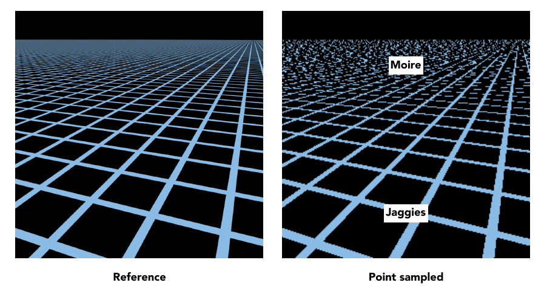
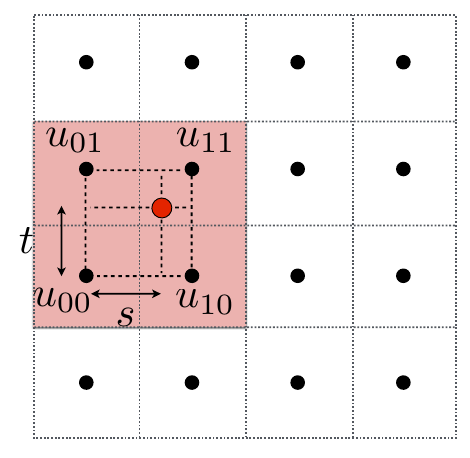
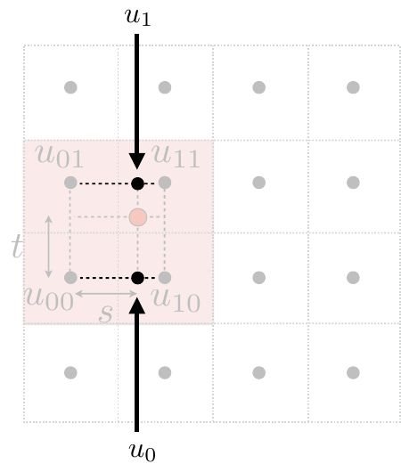
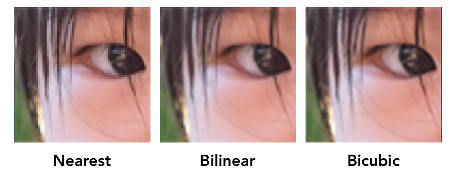
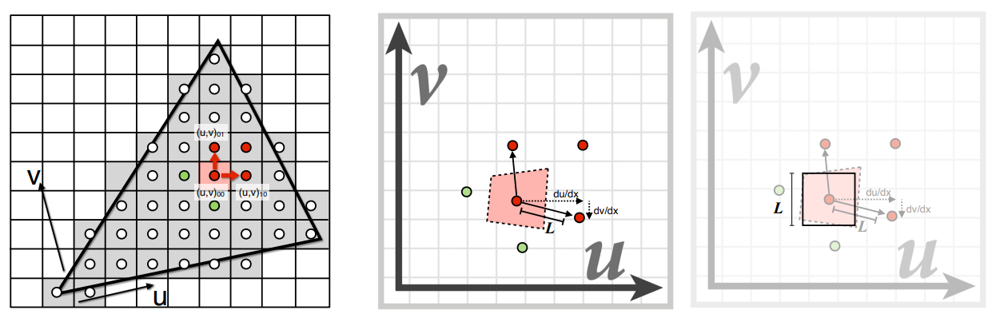
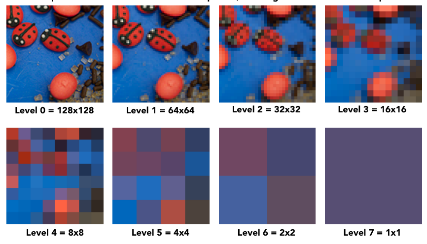
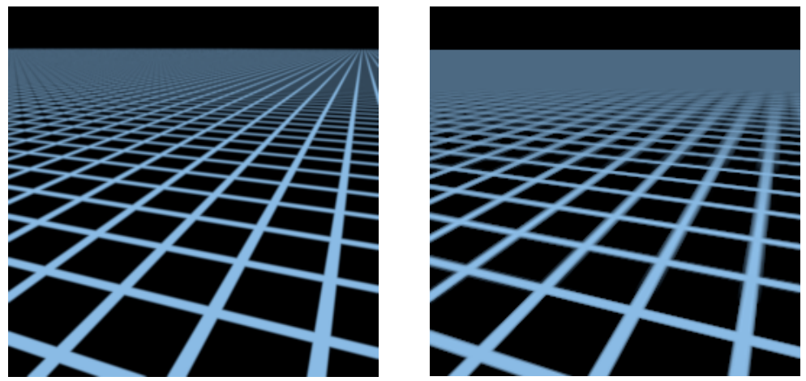
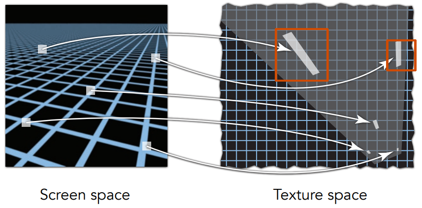
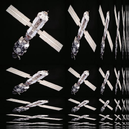

## Lecture 9 Shading - 纹理

**重心坐标插值**

在深度缓存, 顶点着色, 像素着色, 纹理贴图时我们都需要进行插值, 在三角形中, 可以使用重心坐标插值. 

重心坐标是一个三元组$(\alpha,\beta,\gamma)$, 对于三角形$ABC$与点$P$, 重心坐标满足
$$
\left\{\begin{align}
&P = \alpha A + \beta B + \gamma C\\
&\alpha + \beta + \gamma = 1\\
&\alpha \geq 0\\
&\beta \geq 0\\
&\gamma \geq 0\\
\end{align}\right.
$$

- 当$(\alpha,\beta,\gamma)$满足$\alpha + \beta + \gamma = 1$时, $P$在三角形$ABC$所在平面上
- 当$(\alpha,\beta,\gamma)$还满足$\alpha \geq 0,  \beta \geq 0, \gamma \geq 0$时, $P$在三角形$ABC$内

应用"奔驰定理"可以得到
$$
\left\{\begin{align}
&\alpha = S_{PBC}/S_{ABC}\\
&\beta = S_{PAC}/S_{ABC}\\
&\gamma = S_{PAB}/S_{ABC} = 1-\alpha-\beta\\
\end{align}\right.
$$
缺点: 点与三角形在投影后重心坐标会发生变化

**纹理放大**

在三维场景中, 我们可以通过移动摄像机的位置放大或缩小图像(透视原理), 若场景被放的很大(比如凑在脸前面看人), 某个整数像素会对应到纹理坐标中的小数像素(纹理中的像素也被称为纹素/ Texel), 我们需要采用一系列方法对这个小数坐标值进行差值获得该点纹理

- Nearest: 直接将小数下标四舍五入. 这会造成多个像素显示一个纹素, 从而发生走样, 如右图中的Jaggies

  

- 双线性插值(Bilinear interpolation): 对于一个小数位置$P$, 我们找$P$邻近的四个纹素, 记$P$到左下角纹素的距离为$t, s$, 同时易知$y_{u_{00}, u_{01}} = x_{u_{00}, u_{10}} = 1$ 

  

  定义一个一维线性插值($x$在$v_0v_1$上): $lerp(x,v_0,v_1) = v_0+x(v_1-v_0)$

  我们分别对点$P$投影在$u_{01}u_{11}$与$u_{00}u_{10}$的位置做线性插值, 即: $u_0 = lerp(s, u_{00}, u_{10})$与$u_1 = lerp(s, u_{01}, u_{11})$得到第一次插值结果

  

  之后在垂直方向做一次线性插值 $u = lerp(t, u_{0}, u_{1})$

  于是我们得到$P$点的双线性插值$lerp(t, u_{0}, u_{1})$

- 三线性插值(Bicubic interpolation): 就是将双线性插值时选取周围4纹素换成选16纹素

三种方法效果如下

双线性插值性价比更高一些

**纹理过小**

在三维场景中, 我们可以通过移动摄像机的位置放大或缩小图像(透视原理), 若场景被放的很小(比如看远处的山), 某个整数像素会覆盖到纹理坐标中的多个纹素, 我们需要将覆盖的一片区域转为一个像素

如果简单的将像素中心对应到纹理中心, 我们就会因采样率不足而得到摩尔纹(右图远处Moire)

最简单的方法就是使用朴素的MSAA超采样, 但是消耗过大, 我们需要一个快速超采样的办法. 将一个像素映射到一个纹素区域, 然后快速得到这个区域的纹素均值

- 采用近似的方法获得纹素覆盖的纹像区域: 对于像素P, 我们先获P及其上边与右边像素在$u-v$坐标系中对应的纹素坐标, 测量上方与右方纹素到P对应纹素距离. $L_1, L_2$. 取两者最大值作为覆盖范围的边长并构建正方形

  

  可以用微分表达
  $$
  L = \max\left( \sqrt{\left(\frac{du}{dx}\right)^2+\left(\frac{dv}{dx}\right)^2},\sqrt{\left(\frac{du}{dy}\right)^2+\left(\frac{dv}{dy}\right)^2}  \right)
  $$

- 区间求和可以采用树状数组实现, 这里采用了类似的**MipMap**实现, 该方法不像树状数组一样可以精确查询区间$[l,r]$的均值, 其只能获得近似值, 并只能查询一个正方形区间, 但是时间复杂$O(1)$, 空间复杂度$O(n)$

  1. 预处理纹理宽高为$2$的整次幂时的各像素均值

     

  2. 看起来就是做了个分块, 正常的想法是在查询时先查大分块, 到边缘时查小分块. 这样的时间复杂度是$O(logn)$, 

     Mipmap的做法是: 选一个比查询区间边长稍大的块然后获取其值, 对于边长为$l$的正方形, Mipmap直接去$level\ [log_2l]$图中查询像素中心点对应点纹素. 

     由于$level\ n$图比$level\ 0$图小了$2^n$倍, 我们需要查询的整数像素对应到纹素坐标中可能是小数. 在这里可以采用双线性插值的方法实现过渡. 

     这样的查询方法可以将时间复杂度做到$O(1)$, Mipmap占用空间也仅为原图的$1/3$(通过等比级数得到).

  3. 但是这样的方法会造成在level分界边缘的像素产生割裂(相邻几个像素应用了不同level的Mipmap), 我们希望可以在Level之间实现均匀过渡(即获取诸如Level 2.8上的图像), 可以在层与层之间再做一次线性插值: 计算出像素在$level\ [log_2l]$上的纹素后再计算像素在$level\ [log_2l]+1$上的纹素, 最后通过线性插值求得像素在$level\ log_2l$层的纹素

然而Mipmap的效果并不好, 他会将远处覆盖纹理比较斜的像素变模糊. (左图为朴素MSAA的结果, 右图为用Mipmap后MSAA的结果, 可以看到在渲染左上角与右上角时图像会边模糊)

与boungin box效果变差的原因类似, 当一个像素覆盖纹素区域是一个斜四边形时, 这导致覆盖正方形过大, 效果边模糊

可以采用**各向异性过滤**缓解这个问题

在Mipmap预处理不同尺寸正方形的基础上预处理不同尺寸的长方形, 这样在近似求覆盖面积的时候就可以将覆盖面积近似为长方形了. 这样预处理需要占用原纹理3倍的空间.

 
