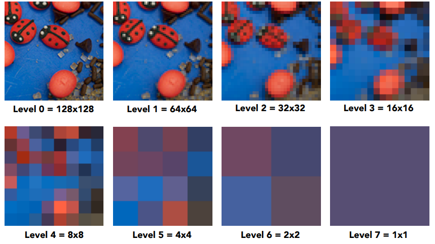

## Lecture 9 Shading - 纹理

**重心坐标插值**

在深度缓存, 顶点着色, 像素着色, 纹理贴图时我们都需要进行插值, 在三角形中, 可以使用重心坐标插值. 

重心坐标是一个三元组$(\alpha,\beta,\gamma)$, 对于三角形$ABC$与点$P$, 重心坐标满足
$$
\left\{\begin{align}
&P = \alpha A + \beta B + \gamma C\\
&\alpha + \beta + \gamma = 1\\
&\alpha \geq 0\\
&\beta \geq 0\\
&\gamma \geq 0\\
\end{align}\right.
$$

- 当$(\alpha,\beta,\gamma)$满足$\alpha + \beta + \gamma = 1$时, $P$在三角形$ABC$所在平面上
- 当$(\alpha,\beta,\gamma)$还满足$\alpha \geq 0,  \beta \geq 0, \gamma \geq 0$时, $P$在三角形$ABC$内

应用"奔驰定理"可以得到
$$
\left\{\begin{align}
&\alpha = S_{PBC}/S_{ABC}\\
&\beta = S_{PAC}/S_{ABC}\\
&\gamma = S_{PAB}/S_{ABC} = 1-\alpha-\beta\\
\end{align}\right.
$$
缺点: 点与三角形在投影后重心坐标会发生变化

**纹理放大**

在三维场景中, 我们可以通过移动摄像机的位置放大或缩小图像(透视原理), 若场景被放的很大(比如凑在脸前面看人), 某个整数像素会对应到纹理坐标中的小数像素(纹理中的像素也被称为纹素/ Texel), 我们需要采用一系列方法对这个小数坐标值进行差值获得该点纹理

- Nearest: 直接将小数下标四舍五入. 这会造成多个像素显示一个纹素, 从而发生走样, 如右图中的Jaggies

  

- 双线性插值(Bilinear interpolation): 对于一个小数位置$P$, 我们找$P$邻近的四个纹素, 记$P$到左下角纹素的距离为$t, s$, 同时易知$y_{u_{00}, u_{01}} = x_{u_{00}, u_{10}} = 1$ 

  

  定义一个一维线性插值($x$在$v_0v_1$上): $lerp(x,v_0,v_1) = v_0+x(v_1-v_0)$

  我们分别对点$P$投影在$u_{01}u_{11}$与$u_{00}u_{10}$的位置做线性插值, 即: $u_0 = lerp(s, u_{00}, u_{10})$与$u_1 = lerp(s, u_{01}, u_{11})$得到第一次插值结果

  

  之后在垂直方向做一次线性插值 $u = lerp(t, u_{0}, u_{1})$

  于是我们得到$P$点的双线性插值$lerp(t, u_{0}, u_{1})$

- 三线性插值(Bicubic interpolation): 就是将双线性插值时选取周围4纹素换成选16纹素

三种方法效果如下

双线性插值性价比更高一些

**纹理过小**

在三维场景中, 我们可以通过移动摄像机的位置放大或缩小图像(透视原理), 若场景被放的很小(比如看远处的山), 某个整数像素会覆盖到纹理坐标中的多个纹素, 我们需要将覆盖的一片区域转为一个像素

如果简单的将像素中心对应到纹理中心, 我们就会因采样率不足而得到摩尔纹(右图远处Moire)

最简单的方法就是使用朴素的MSAA超采样, 但是消耗过大, 需要一个快速超采样的办法. 也就是说我们有一个**固定的**纹理, 我们要用某些方法快速求得其一片区域的均值. 可以想到前缀和, 这里也应用了类似的做法, 称之为Mipmap

预处理纹理宽高为$2$的整次幂时的各像素均值

于是可以像线段树一样实现$O(logn)$的求和, 但是我们希望实现$O(1)$的求和

为什么不能在之前反走样的时候也采用这种算法呢? 因为这里纹理是固定的, 我们只需做一次Mipmap即可, 但是之前图是固定的, 每一帧就要算一个Mipmap

