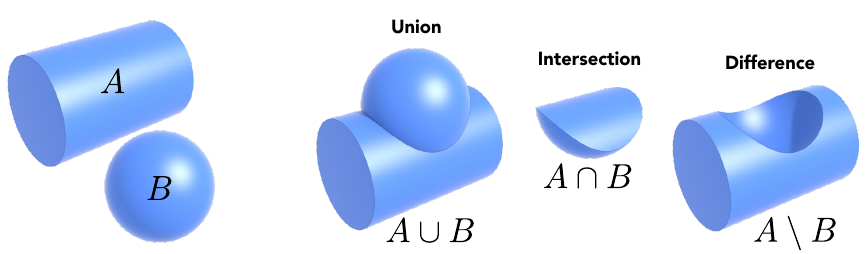
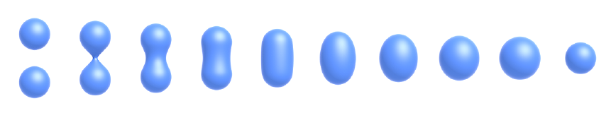
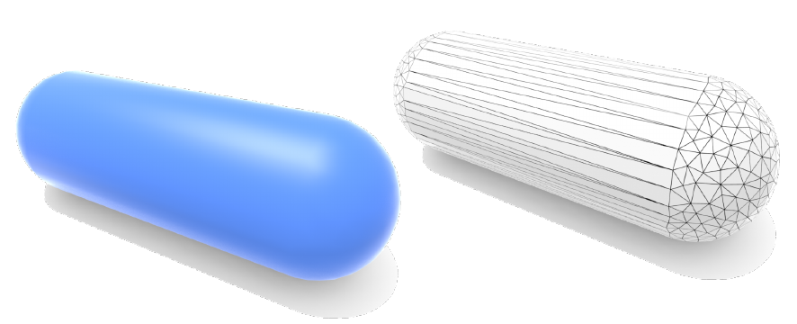

## Lecture 10 Geometry

几何分类

- 隐式几何(Implicit): 不直接定义点, 而定义点满足的条件(例如定义球上的点$x^2+y^2+z^2=1$). 

  我们很难直接得知其表示什么结构, 但是可以很轻松的判断点在不在几何体上. 

  常见的隐式表示:

  - 代数方法: 列表达式

  - 构造立体几何法(Constructive Solid Geometry): 通过简单几何体的布尔运算(交并补)描述其他几何体

    

  - 距离函数: 不描述几何体上的点, 而描述一个点到几何体上点的距离. 这种描述方式很适合表述几何体的融合过程(我们定义SDF函数为图片上点到物体边界的距离, 将两个图像融合就是将两个距离函数相加. 距离函数为0的部分就是物体的表面)

    

  - 水平集: 提取距离函数为$n$的曲线的集合

  - 分形表示

- 显式几何(explicit): 直接给出几何体(如三角形的顶点), 或者通过参数映射的形式给出(给出参数范围, 给出参数到坐标的参数方程)

  我们很难直接得知点与几何体的关系, 但是可以很轻松的得知其表示结构
  
  常见的显式表示:
  
  - 点云(point cloud): 用足够密的点堆砌表面
  
  - 多边形面表示(最常用): 用多边形拼接描述复杂的物体
  
    
  
    
  
  

