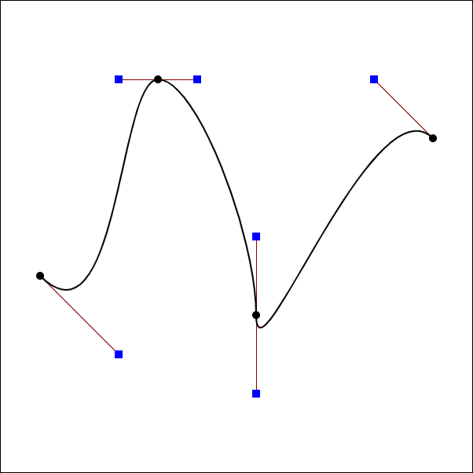

## Lecture 11 Geometry - 曲线与平面

**曲线的显式表示**

- 贝塞尔曲线(Bezier Curves)

  - 二次贝塞尔曲线: 按顺序定义两个点$P_1$, $P_2$, 定义一个新点$P$, 取$t\in [0,1]$,  在$t=t_0$时, $P$的位置是线段$P_1P_2$上距离$P_1$长度为$t \times length_{P_1P_2}$的位置

  - 二次贝塞尔曲线: 按顺序定义三个点$P_1$, $P_2$, $P_3$, 定义三个新点$P_4$, $P_5$, $P$, 取$t\in [0,1]$,  在$t=t_0$时, $P_4$的位置是线段$P_1P_2$上距离$P_1$长度为$t \times length_{P_1P_2}$的位置,  $P_5$的位置是线段$P_2P_3$上距离$P_2$长度为$t \times length_{P_2P_4}$的位置, 连接$P_4P_5$, $P$在线段$P_4P_5$上距离$P_4$长度为$t \times length_{P_4P_5}$的位置, $P$的轨迹就是二次贝塞尔曲线

    

  - 以此类推, 三次贝塞尔曲线就是取三个线段上三个点, 连成两个线段, 取二次贝塞尔曲线在$t$时的位置, 

  - 如何实现贝塞尔曲线: 
    
    遵循贝塞尔曲线定义: $P_1\to P_2$的点可以表示为$(1-t)P_1+t(P_2)$, 递归应用即可
    
    常用的就是三次贝塞尔曲线, 我们有锚点$P_1, P_2, P_3, P_4$, 其中固定$P_1=(0,0), P_4=(1,1)$在, 变量只有$P_{2}, P_{3}$, 曲线公式为
    $$
    b(t) = P_1(1-t)^3+3P_2t(1-t)^2+3P_3t^2(1-t)+P_4t^3, t\in [0,1]
    $$
    实际效果与二次项展开类似, 可以得到更普遍的定义: 
    
    通过$n+1$个控制点可以得到$n$阶贝塞尔曲线, $b^n_j(t)$表示在$t$时刻, $n$阶第$j$个点的位置
    $$
    \begin{align}
    b^n(t) &= b^n_0(t) = \sum_{j=0}^nb_jB^n_j(t)\\
    B^n_i(t) &=\left( \begin{matrix}n\\i\end{matrix} \right)t^i(1-t)^{n-i}
    \end{align}
    $$
    其中$B^n_j(t)$为伯恩斯坦多项式, 实际说的就是二次项展开
    
  - 性质

    - $t=0$时都在起点
    - 对于三次贝塞尔: 在$t=0$时, $b^1_0(0)$与$b^1_2(0)$的运动方向切线分别为$b^{1'}_0(0)=3(b_1-b_0), b^{1'}_1(0)=3(b_3-b_2)$
    - 贝塞尔曲线上的点与控制点同时做仿射变换(投影不行), 点不变(想要对曲线做变换可以直接对控制点做变换). 
    - 贝塞尔曲线一定在控制点围成的突包内

- 逐段贝塞尔曲线(Piecewise Bezier Curves)

    当贝塞尔曲线阶数变高时, 对于$n$阶贝塞尔曲线, 我们需要$n+1$个点才能控制一个曲线, 此时曲线的控制就变困难了. 我们希望可以分段表示曲线, 然后将其拼接起来. 一般使用每四个点定义贝塞尔曲线的一段(Piecewise cube Bezier)

    

    每条曲线由两端各自的一个黑点和一个蓝点共四个控制点组成. 对于中间的点, 点上有一个共用的黑点与两个曲线各自的蓝点组成

    如果想要保证两段曲线在衔接处连续, 只需要保证在衔接处两个黑蓝线**等大共线反向**

