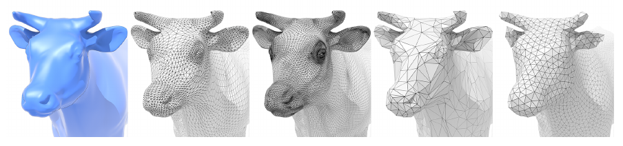
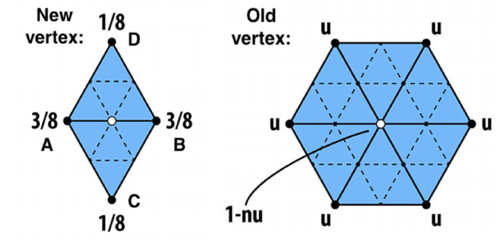
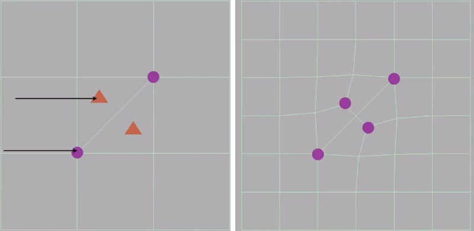
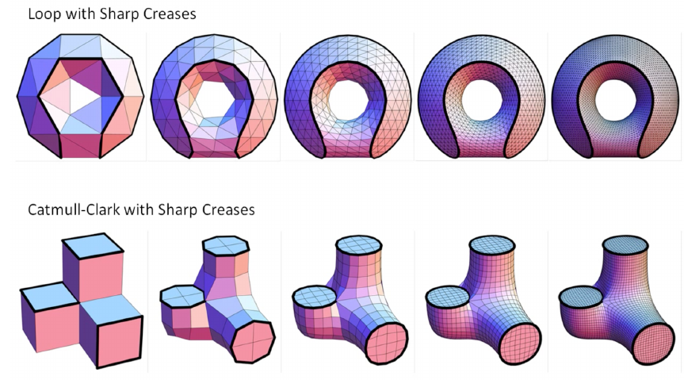
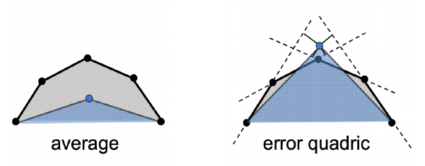
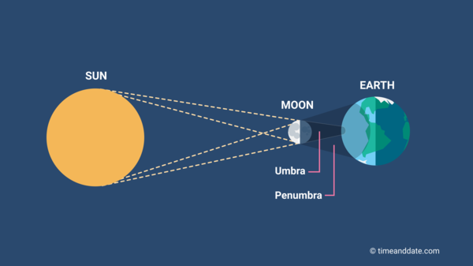

## Lecture 12 Geometry - 曲面操作与阴影

可以对曲面上三角形进行操作

- 曲面细分(Mesh Subdivision / upsampling): 三角形数量增加, 表示的曲面更加光滑(图$2\to 3$)
- 曲面(Mesh Simplification / downsampling): 三角形数量减少, 简化曲面(图$2\to 4$)
- 曲面正则化(Mesh Regularization / same #triangles): 让三角形面变得更加规则, 减少尖锐的三角形, 让三角形尽量接近等边三角形(图$2\to 5$)

**三角形细分**

引入更多的三角形, 同时让三角形位置相对于原来大三角形位置变化, 从而使物体变得更光滑. 常见的算法: 

- Loop Subdivision(发明者是Loop, 不要译为循环细分), 只适用于三角形

  1. 引入三角形: 三角形三边取中点, 中点间连线, 于是1个三角形变成4个

  2. 调整位置: 

     - 对于引入新顶点(中点): $P = 3/8 * (A + B) + 1/8 * (C + D)$, $A, B$为所在边的顶点. $CD$为相邻两个三角形对边顶点

     -  对于原有顶点: 
       $$
       \begin{align}
       P & = (1 - n*u) * original\_position + u * neighbo\_position\_sum \\
       v & = 被调整顶点度数 \\
       u & = \left\{
       \begin{matrix}
       3/16& \ &n = 3\\
       3/8n& \ &otherwise
       \end{matrix}
       
       \right.
       \end{align}
       $$
       注意这里是针对一个原有顶点计算的, 计算相邻点位置的时候$n$还是被调整点度数, 而不是相邻点的度数

     

- Catmull-Clark Subdivision, 适用于一般平面

  1. 定义四边形面(quad face)与非四边形面(none-quad face). 度不为4的点为奇异点(Extraordinary Vertex)

  2. 引入点: 取每个边与面的中点, 将边的中点与面的中点连接

     

     可以看到, 第一次引入新点后: 

     - 非四边形面全没了
     - 非四边形面中点变成新奇异点, 度数为原多边形面数
     - 原奇异点度数不变

  3. 调整位置

     - 对于面的中点: 位置是所在平面四个点均值
     - 对于边上中点: 位置还是相邻面中点于所在边端点均值
     - 原来的点: $\frac{\sum_if_i+2\sum_im_i+4p}{16}$, 其中$f_i$是相邻面中点, $m_i$是相邻边中点, $p$是被调整点位置

可以看到, 我们这些算法并不是根据原物体形态对顶点调整的, 而是根据已有节点获取一个新点坐标, 看起来是一种"高级的曲面插值". 这样的做法不能让细分后模型更加接近于原物体, 但是可以让模型更加光滑, 例如

**曲面简化**

有的时候我们不希望顶点太多(物体离得很远, 没必要渲染那么仔细), 所以需要曲线细分, 

算法: 边坍缩, 去掉一个边, 把相邻节点连起来

- 找到新点: 

  

  假设需要将灰色部分坍缩成三个点并产生一个蓝色的新点, 但是新点的位置难以确定. 如果采用均值会得到左边的效果, 我们使用二次度量误差(Quadric Error Metrics)评价点的位置, 让新点距离平面距离和最小.

- 找到需要坍缩的边: 为每个边计算坍缩后二次度量误差最小的边. 但是每次坍缩后其他边的二次度量误差会变化, 我们需要动态维护边的二次度量误差, 用一个Heap即可

- 这是一个贪心算法, 虽然不是最优, 但是看着不错

**阴影生成**

可以在光栅化时候进行阴影生成(Shadow Mapping). 

- Shadow Mapping是一个图像空间的做法: 在生成阴影时无需知道物体的几何信息.
- 只适用于点光源
- 会产生走样现象
- 只能生成硬阴影(一个点要么在阴影里, 要么不在阴影里)
- 存在数值精度问题

核心思想: 如果一个点不再阴影里, 那么从光源方向与摄像机方向都能看到他

实现: 

- 将光源当作摄像机维护每个点此时的Depth Buffer
- 从原摄像机点做光栅化, 对于屏幕上的每个点, 计算点到光源的距离并于上一步维护的Depth Buffer比较, 如果距离大于Depth Buffer就说明光打不到, 此处是阴影
- 由于Depth Buffer像素有尺寸(如: Depth Buffer是1080P的, 但是光栅化是2K的, 光栅化的一个像素不对应Depth Buffer上一个像素), 浮点数误差, 很难精确比较两个距离是否相等. 一般可用实际深度大于Depth Buffer深度+esp判定被遮挡. 但是依然很难准确实现

**硬阴影与软阴影**

在Shadow Mapping时, 我们认为光源是点光源, 但是实际光源是有体积的, 例如上图月食现象 中, 地球上一部分是完全看不到光的(Umbra区域), 一部分是可以看到一部分光的(Penumbra区域), 将完全看不到光的阴影称为硬阴影, 将可以看到部分光的阴影称为软阴影. 
