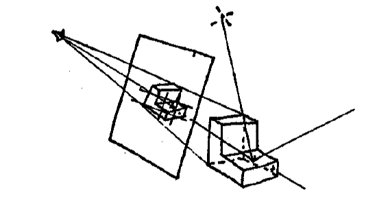
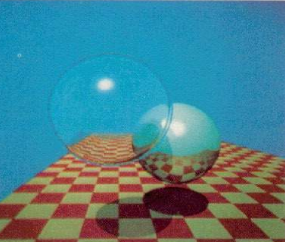
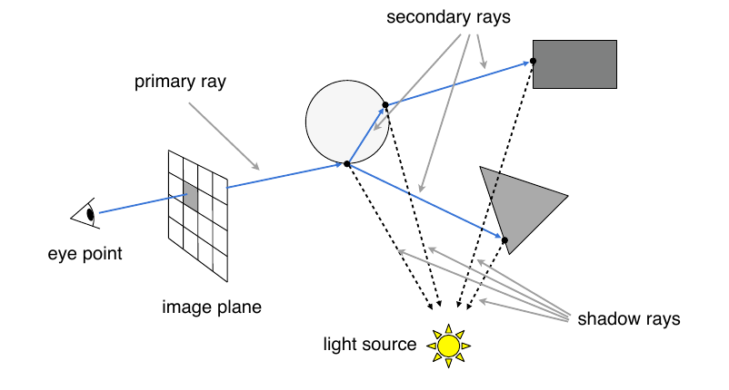
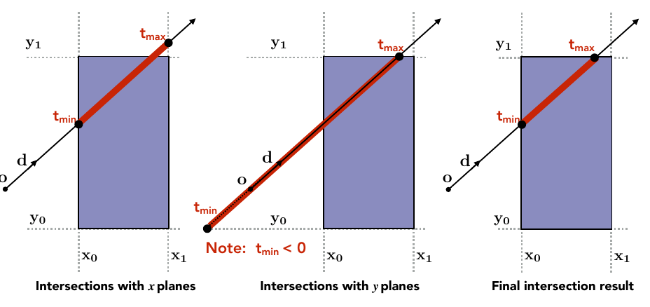
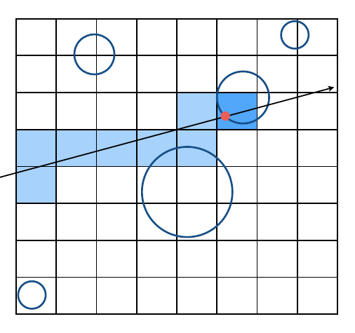
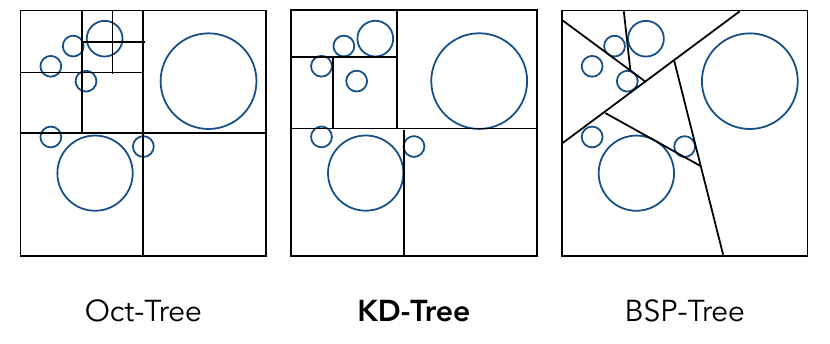
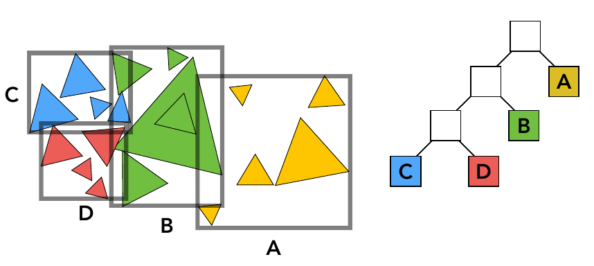

## Lecture 13 Ray Tracing - Whitted-Style光线追踪

光线追踪与光栅化是两种**完全不同的成像方式**(相互替代)

光栅化针对单点处理, 但不能实现全局效果(软阴影,  磨砂镜面反射, 间接光照). 光追可以实现全局效果, 但是非常慢, 一般用于离线渲染(电影等)

**光线追踪的基本假设**

- 光沿直线传播(不考虑波动性)
- 光线碰撞后不改变原传播性质
- 人可以看到图像是因为光线从光源发出, 不断反射折射, 最后进入人眼. 光路是可逆的(人可以看到物体也可以认为是人眼发出了某种感知光线, 最后汇集到光源处)
- 人眼是一个点
- 光线在物体表面会发生完美折射

光线追踪就是模拟人眼发出感知光线, 通过不断反射折射最后汇集到光源的过程(汇集不到光源的感知光线就在折射反射时衰减完了...). 

**感知光线投射**

从人眼看向屏幕, 让眼睛发出的光线穿透屏幕打在物体上, 先不考虑折射与多次反射, 我们直接将着色点与光源连线, 如果连线之间没有遮挡那说明该点不在阴影中, 使用着色模型就可以计算是什么颜色. 至此, 我们得到了与光栅化相似的结果. 在光追中我们对算法进行了一些改进 

**Whitted-Style光线追踪**

一种比较古老的光追算法, 效果不是很好

我们看右侧哪个"金属球", 可以看到球上有本身的金属银色, 也有反射环境光得到的颜色. 左侧的"玻璃球"上还可以看到折射看到的背后的光 

在Whitted-Style光追中, 人眼发出的光线(eye ray / primary ray)在打到物体点上后被打散为三种光线

- eye ray通过非完美反射打到光源, 通过着色模型得到物体本身颜色
- 通过完美反射得到其他物体的颜色
- 通过折射得到的其他物体颜色

在每次反射折射后光线能量会衰弱, 可以使用递归实现该算法 

**存在的问题**

- 如何判断感知光线和哪个物体相交, 交点在哪里(我们需要让光在三维物体之间反复反射, 所以不能使用Depth Map实现)
- 反射光折射光方向与衰减计算

**光与物体交点计算**

- 光线的定义: 原点($O$)与方向(单位向量$\vec{d}$)组成, 光线就是一系列点$O+td, (0\leq t<\infty)$

- 光源与物体关系判定: 若光线与物体有偶数个交点则光源在物体外, 有奇数个交点则光源在物体内

- 光线与隐式定义曲面的交点: 将光线方程与曲面方程联立. 舍去$t$的复数根与负根, 取最小的$t$为第一个交点

- 光线与显式定义曲面的交点: 

  光线与曲面交点不是很好求, 但是光线三角形的交点还是很好求的

  - 光线与三角形求交点

    先求光线与三角形面的交点, 再判断交点在不再三角形内

    平面可以用平面上一个点$P'$及其法向量$\vec{N}$表示,  平面上任意一点$P$满足$\vec{PP'}\cdot \vec{N} = 0$, 将光线表示为$O+t\vec{d}$

    联立即可: $(O+t\vec{d}-P') \cdot \vec{N} = 0$, 使用克莱姆法则可以得到
    $$
    t = \frac{(P'-O)\cdot N}{d\cdot N}
    $$
    最后判断点是否在三角形内部

  - Moller Trumbore算法

    就是将上面步骤与重心坐标判断点与三角形位置组合在一起
    $$
    \begin{align}
    
    \left[\begin{matrix}
    t\\b_1\\b_2
    \end{matrix}\right]=\frac{1}{S_1\cdot E_1}
    \left[\begin{matrix}
    S_2\cdot E_2\\S_1\cdot S\\S_2\cdot D
    \end{matrix}\right]
    \end{align}
    $$
    其中
    $$
    E_1 = P_1-P_0\\
    E_2 = P_2-P_0\\
    S = O-P_0\\
    S_1 = D\times E_2\\
    S_2 = S\times E_1\\
    $$

  - 判断光线与每个三角形求交太慢了, 采用类似Bounding Box的思想加速求交

**Bounding Volumes**

将物体用相对简单的形状包起来, 若光线与Bounding Volumes不想交那一定不和物体相交. 为了方便计算, 我们一般用边与坐标轴平行的立方体做包围和. 在处理光线与立方体相交判定问题时我们可以采用坐标轴分解. 核心思想是: 如果点在立方体内部, 那么点与立方体投影在$xoy, yoz, zox$上时, 点都在投影矩形内部. 如果任何一个方向投影不成立, 点就不在立方体内部.

由于我们选取的立方体边都平行于坐标轴, 很容易做相交计算, 对于一个投影平面(以$xoy$为例), 只需求射线与矩形交点时$t$并对范围求交(下图先求射线与$x$交点, 再求$y$, 最后求$t$取值的交集), 对三面分别投影求交即可得到光线穿过立方体的$t$取值范围, 计$t_{enter} = t_{min}, t_{exit} = t_{max}$

讨论如下情况

- $t_{exit} < 0$: 物体在光线后面
- $t_{exit} \geq 0, t_{enter} < 0$: 光源在物体里面
- $t_{exit} \geq 0, t_{enter} < t_{exit}$: 正常情况

**利用光线与Bounding Volumes相交加速光线与曲面相交**

- Uniform Grids方法(在物体分布均匀时效果好)

  将场景均匀的分成等大的小盒子, 记录盒子与哪个物体相交, 若光线与盒子相交着判断光线与对应物体是否相交

  

  - 如何找到浅蓝色路径呢? 如果光线与一个浅蓝色格子相交, 那么下一个浅蓝色格子一定在这个格子周围八个格子
  - 格子尺寸如何确定: $格子数 \approx 27 \times 场景中物体数目$(经验公式)

- Spatial Partitions方法(在场景空旷时效果好)

  我们不希望将空间划分为等大的方块, 而是为空旷空间分配大格子, 密集空间分布小格子. 常见划分方法有: 

  

  - 八叉树(Oct-Tree): 将一个节点分为八个子节点(类似一维的二叉树). 在切割时, 若节点中有足够数量少的物体(例如节点只与一个物体相交)就停止

  - KD-Tree: 八叉树实际上是使用了二叉树的思想, 但是在高维空间中, 树的分枝数成指数倍增长(四维的16叉树), 于是提出了KD-Tree. 划分空间时依次从不同轴切物体. 切开的物体在下次切割时候独立切割(切线可以不在一起)于是可以用二叉树存储KD-Tree. 非叶子只需要保存切线, 叶子节点保存相交的曲面. 采用类似二分的方法找到第一个与光相交的叶子节点

    KD-Tree存在的问题: 难以判断物体与盒子相交. 一个物体可以出现在多个Bounding Volumes中

  - BSP-Tree: 每次将空间划分为等物体数两块. 但是BSP-Tree的切线不平行于轴线, 高维时切面难以计算

- Object Partitions & Bounding Volume Hierarchy(BVH) (综合最好)

  Spatial Partitions中判Bounding Volumes与物体关系太麻烦了, 我们可以反向操作, 通过物体生成Bounding Volumes. 然后对Bounding Volumes操作

  我们将一组物体(一个Bounding Volume)采用某种方法(例如KD-Tree思想)划分成两部分, 生成两个Bounding Volume, 递归进行多次划分与重算Bounding Volume(可以用二叉树存储这一过程). 这样一个物体只存在于一个Bounding Volume, 同时一个Bounding Volume中的物体也是已知的(例如图中虽然蓝绿Bounding Volume有交集, 但是仍然可以分清哪个三角形属于哪个区域)

  

  划分三角形的技巧

  - 每次取一个维度进行划分(划分面与坐标面平行), 但是不必要像KD-Tree一样依次划分
  - 每次将Bounding Volume最长轴砍断
  - 每次从第$n/2$个三角形处划分(计算物体重心并使用快速选择算法$O(n)$实现. 快速划分算法借助快速排序思想实现了查找第$n$大的数:在快排每次找到中间节点时只查找自己需要的那一半)
  - 当包围的节点数足够少时停止(比如5个)
