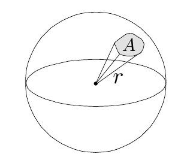
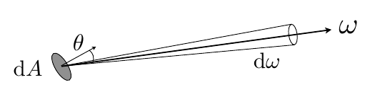

## Lecture 14 Ray Tracing - 辐射度量学

辐射度量学: 精确描述光相关物理量的方法与单位, 定义了光照在空间中的属性

**Radiant Energy and Flux(Power)**

Radiant Energy: 电磁辐射出的能量, 物理量$Q$, 单位$J$

Radiant Flux(Power): 单位时间的能量类似功率, 物理量$\Phi = \frac{dQ}{dt}$, 单位$W$或$lm$(流明, 光学专用)

**Radiant Intensity**

描述辐射源的物理量, 表示**单位立体角(unit solid angle)发出**的功率
$$
I(\omega) = \frac{d\Phi}{d\omega}
$$
单位$\frac{lm}{sr} = cd$, 其中你$sr$为立体角单位

单位立体角/微分立体角

- 在二维图形中, 用弧度描述二维角, 且$\theta = \frac{l}{r}$

- 在三维图形中, 用立体角描述三维角, 且$\Omega = \frac{A}{r^2}$, A为投射球面积

  

  面积计算(利用球坐标系统)
  $$
  dA = r^2 \sin\theta\ d\theta\ d\phi
  $$
  单位立体角就是$单位面积/r^2$, $d\omega = dA/r^2=\sin\theta\ d\theta\ d\phi$

- 球体立体角为$4\pi$(设一个半径为1的球, 立体角和为面积)

**Irradiant**

描述辐射接收者的物理量, 表示**单位面积接受**的功率

物理量$E$, 单位$\frac{lm}{m^2}=lux$

此处的单位面积为与入射光线**垂直**的单位面积, 若不垂直则计算垂直分量$E = \frac{\Phi}{A}\cos\theta$

**Radiance**

描述光线的空间属性, 表示**单位立体角单位投影面积**上的功率
$$
L(p,\omega) = \frac{d^2\Phi(p,\omega)}{d\omega \cos\theta}
$$

考虑光线从一个很小的表面辐射出, 并且在一个点上向四面八方投射其在单位立体角辐射出功率就是Radiance

还可以分为Incident Radiance与Exiting Radiance, 分别表示射入与发出的能量

可以这样理解

- Irradiant: 单位面积而收到的功率
- Radiance: 单位面积单位方向收到的功率
