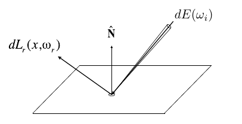

## Lecture 15 Ray Tracing - 光线传播

**Bidirectional Reflectance Distribution Function (BRDF) 双向反射分布函数**

BRDF函数描述入射光线在物体表面的不同方向的能量反射分布. 可以将反射理解为物体表面吸收了所有入射光后将一部分光再发射出去的过程

- 单位表面吸收的从$\omega_i$方向射入能量: $dE(\omega_i) = L(\omega_i)\cos\theta_i\ d\omega_i$

- BRDF函数定义单位表面在$\omega_r$方向反射能量占接收能量占比(BRDF在每个反射方向具体值由物体材质决定)
  $$
  f_r(\omega_i\to \omega_r) = \frac{dL_r(\omega_r)}{dE_i(\omega_i)} = \frac{dL_r(\omega_r)}{L_i(\omega_i)\cos\theta_id\omega_i}
  $$

- 物体表面从任意方向接收光线在某一角度反射光(对每个入射方向积分)
  $$
  L_r(p, \omega_r) = \int_{H^2}f_r(p,\omega_i\to \omega_r)L_i(p,\omega_i)\cos\theta_i\ d\omega_i
  $$

- 上面这个方程仅考虑了从不同光源照向物体的反射光, 没有考虑间接反射

**渲染方程(Rendering Equation)**

同时考虑反射光与物体本身发出的光

$$
L_o(p, \omega_o) =L_r(p, \omega_o) + \int_{\Omega^+}f(p,\omega_i, \omega_o)L_i(p,\omega_i)(n\cdot\omega_i)\ d\omega_i
$$
对于面光源: 可以对面光源覆盖的每个立体角做积分

对于二次反射: 可以将反射来光的物体当作一个面光源处理

可以在数学形式上简化成算子微分方程
$$
L(u) = e(u) + \int L(v)K(u,v)\ dv
=E+KL
$$
$K$是入射能量, $L$是某点辐射能量算子, 应用泰勒展开求得$L=E+KE+K^2E+K^3E+...$

可以理解成点发出的能量$L=$该点直接发出的能量$E+$光源一次反射能量$KE+$两次反射能量$K^2E+...$
