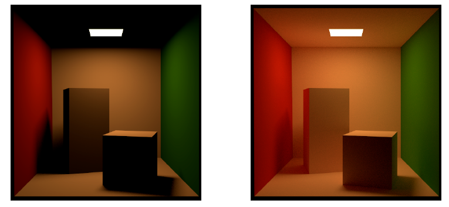
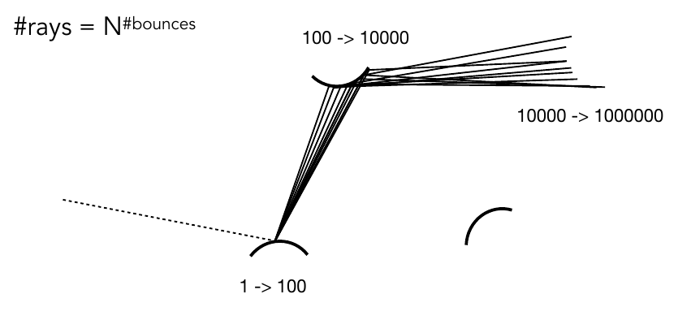
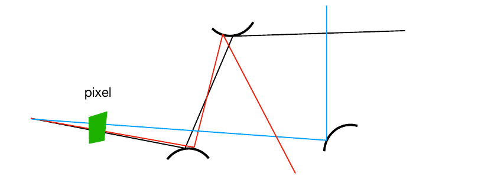
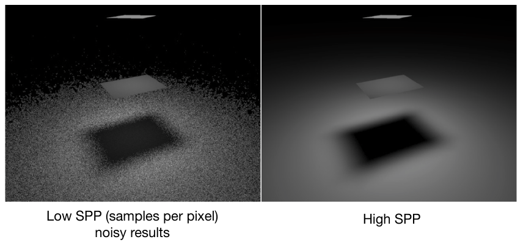
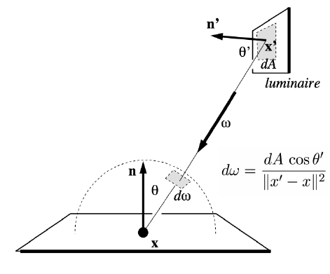

## Lecture 16 Ray Tracing - 蒙特卡洛路径追踪

**蒙特卡洛积分**

求定积分时的常见思路是先求不定积分, 再通过上下界获得定积分. 但是当函数较为复杂时, 不定积分不易求解. 蒙特卡洛积分是另一种积分方法. 在积分区间中随机取几个数及其对应的$f(x)$, 求这几个$f(x)$的均值, 认为定积分可以近似成
$$
\int f(x)dx = \frac{1}{N}\sum_{i=1}^N\frac{f(X_i)}{p(X_i)}
$$
$p(X_i)$为一个随机变量$X_i$在采样时被选中的概率, 当随机变量均匀在$[a,b]$采样时可以认为$p(X_i)=\frac{1}{b-a}$. 
$$
\int_a^b f(x)dx =  \frac{b-a}{N}\sum_{i=1}^Nf(X_i)
$$
**路径追踪**

Whitted-Style Ray Tracing的思想是无限弹射"感知光线", 每次记录反射点颜色. 存在问题

- 不能认为光线在物体表面发生完美镜面反射

- 将反射点直接与光源相连没有考虑漫反射(注意下图天花板与立方体侧边映射的墙面颜色)

  

可以采用图像度量学方法取代Ray Tracing. 需要做的就是解出渲染方程
$$
L_o(p,\omega_0) = L_e(p,\omega_0)+\int_{\Omega^+}L_i(p,\omega_i)f_r(p,\omega_i, \omega_o)(n\cdot \omega_i)\ d\omega_i
$$
**实现**

- 定积分求解: 蒙特卡洛积分, 在不同方向上采样, 采样区间是一个半球, $p(\omega) = 1/2\pi$(半球面立体角是$2\pi$). 在代码实现时, 只需要从着色点发出$N$条光, 求$\frac{1}{N}\sum_{i=1}^n\frac{L_i(p,\omega_i)f_r(p,\omega_i,\omega_o)(n\cdot \omega_i)}{p(\omega_i)}$
- 间接光照$L$的递归定义: 可以把间接光照的反射物体当作光源, 计算从着色点看向反射点的颜色

```
shade(p, wo)
    Randomly choose N directions wi~pdf
    Lo = 0.0
    For each wi
        Trace a ray r(p, wi)
        If ray r hit the light
        	Lo += (1 / N) * L_i * f_r * cosine / pdf(wi)
        Else If ray r hit an object at q
        	Lo += (1 / N) * shade(q, -wi) * f_r * cosine / pdf(wi)
    Return Lo
```

**问题**

- 通过这种方式求的间接光照时, 每次求间接光照都要做一个蒙特卡洛积分采样(如图, 假设一次积分采样100个点, 若这100个点都打到其他物体上, 经过$n$次间接光照我们需要做$100^{n+1}$次)

  

  规避指数爆炸最简单的方法就是将底数变成1(每次定积分只随机采一个点). 这会产生噪音(随机采样点选的不好), 但是只要穿过一个像素点的eye ray足够密集就可以避免这一问题(如图, 我们发出足够密的eye ray, 但是每次间接反射时只反射一次)

  

  **采样数$N=1$的渲染方程实现就是路径追踪**

- 没有定义递归边界

  光线是无限弹射的(虽然有损耗, 但是能量一定不会降为0, 一定是无限弹射), 计算机中不能这样. 人们引入了俄罗斯轮盘赌(Russian Roulette)的思想: 每次弹射时令光有$p$的概率继续弹射, 若随机到$p$范围内则继续弹射并将弹射结果$/p$返回, 若随机到$1-p$着直接返回$0$, 递归执行后其返回值数学期望$E = P*(Lo/P)+(1-P)*0 = Lo$

应用上述改进

```
shade(p, wo)
    Manually specify a probability P_RR
    Randomly select ksi in a uniform dist. in [0, 1]     # 轮盘赌
    If (ksi > P_RR) return 0.0;
    
    Randomly choose ONE direction wi~pdf(w)              # N=1的路径追踪
    Trace a ray r(p, wi)
    If ray r hit the light
    	Return L_i * f_r * cosine / pdf(wi) / P_RR
    Else If ray r hit an object at q
    	Return shade(q, -wi) * f_r * cosine / pdf(wi) / P_RR

ray_generation(camPos, pixel)
    Uniformly choose N sample positions within the pixel
    pixel_radiance = 0.0
    For each sample in the pixel
        Shoot a ray r(camPos, cam_to_sample)
        If ray r hit the scene at p
        	pixel_radiance += 1 / N * shade(p, sample_to_cam)
    Return pixel_radiance
```

路径追踪并不高效, 一旦采样率(穿过一个像素的eye ray, Samples Per Pixel/SPP)过低, 就会因为$N=1$产生噪音



如果我们可以提高采样线命中光源的概率就可以减少SPP, 这需要修改之前的均匀采样模式(同样概率密度函数也会变): 可以直接换采样源, 从光源处采样, 强制采样样本都从光源处来



在光源上均匀采样, 光源面积为$A$, 那么采样$p = 1/A$. 渲染方程从反射点采样变成光源采样模式, 即$d\omega = \frac{dA\cos\theta'}{\|x'-x\|^2}$
$$
\begin{align}
L_o(p,\omega_0) &= \int_{\Omega^+}L_i(p,\omega_i)f_r(p,\omega_i, \omega_o)\cos\theta\ d\omega_i\\
&= \int_{A}L_i(p,\omega_i)f_r(p,\omega_i, \omega_o)\frac{\cos\theta\cos\theta'}{\|x'-x\|^2}\ dA
\end{align}
$$
应用光源采样改进后的算法, 在每次计算反射时将光分为两部分

- 计算直接光照: 换积分域, 无需使用RR
- 计算多次反射光: 采用之前的俄罗斯轮盘赌

```
shade(p, wo)
    # Contribution from the light source.
    L_dir  = 0.0
    Uniformly sample the light at x’ (pdf_light = 1 / A)
    Shoot a ray from p to x'
    If the ray is not blocked in the middle			# 防止物体遮挡
    	L_dir = L_i * f_r * cos θ * cos θ’ / |x’ - p|^2 / pdf_light
    
    # Contribution from other reflectors. 还是原来的俄罗斯轮盘赌
    L_indir = 0.0
    Test Russian Roulette with probability P_RR
    Uniformly sample the hemisphere toward wi (pdf_hemi = 1 / 2pi)
    Trace a ray r(p, wi)
    If ray r hit a non-emitting object at q
    	L_indir = shade(q, -wi) * f_r * cos θ / pdf_hemi / P_RR
    
    Return L_dir + L_indir
```

存在的其他问题: 难以如何处理点光源($dA$太小了)

**注意蒙特卡洛积分, 俄罗斯轮盘赌思想和降低SPP方法**

**路径追踪后的工作**

- 如何对球体进行均匀采样: 采样理论
- 如何对特定形状设计好的采样方法与pdf(除了光源采样): 重要性采样
- 如何评价随机数生成质量(均匀分布, 相邻随机数之间距离): 低差异化序列
- 如何结合半球采样与光源采样: 多重重要性采样(MIS)
- 通过一个像素的eye rays如何加权得到打在像素的能量
- 像素的颜色如何确定(路径追踪的结果是"功率", 功率与颜色并非线性对应): 伽玛矫正, 颜色空间

**其他广义光追算法**

- [x] Whitted-style ray tracing
- [x] path tracing
- [ ] 单向path-tracing
- [ ] 双向path-tracing
- [ ] 光子映射
- [ ] Metropolis 光线传输
- [ ] VCM
- [ ] UPBP(大杂烩)
