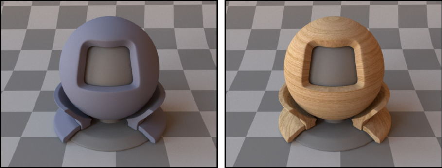
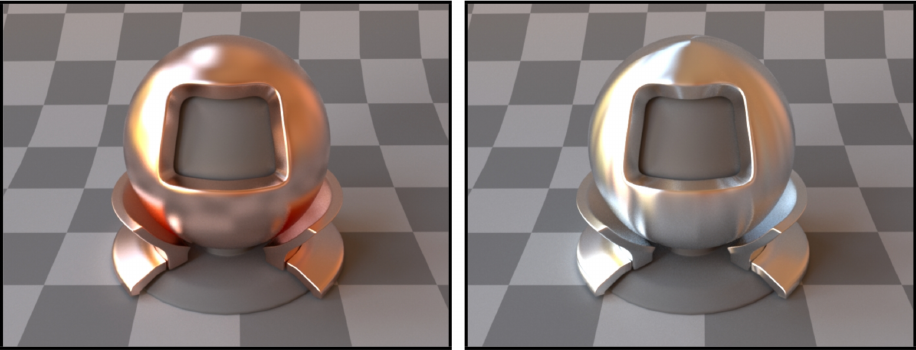
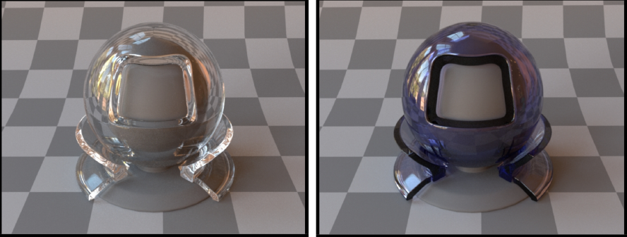
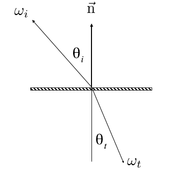
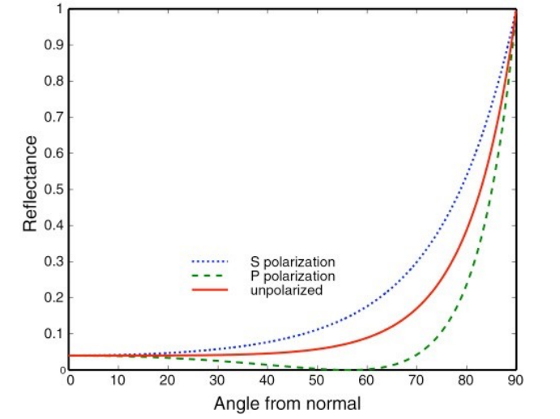
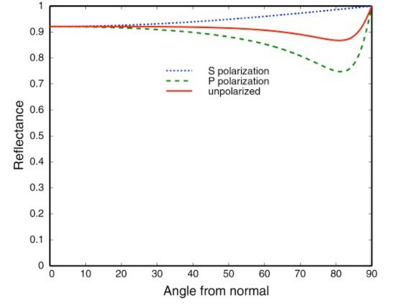
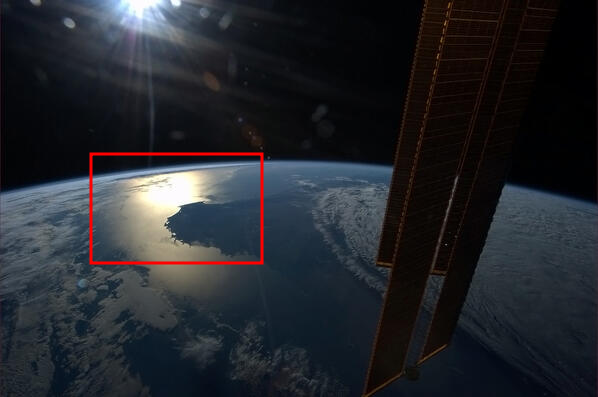
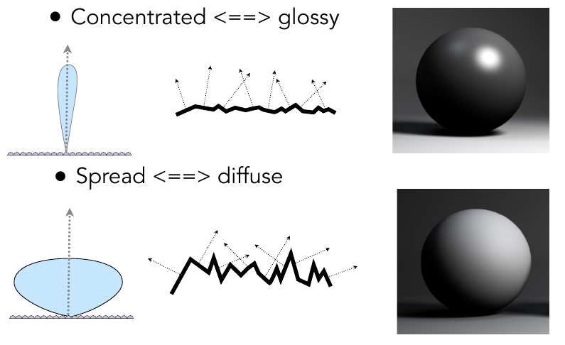

## Lecture 17 Materials and Appearances

研究问题: 光照与材质之间的作用, 实际上就是研究材质的BRDF函数

**勃朗材质(Lambertian Material)**

勃朗材质自己不发光, 且只发生漫反射. 

当入射光均匀打在物体上, 根据能量守恒可以得到
$$
\begin{align}
L_o(\omega_o) &= \int_{H^2}f_rL_i(\omega_i)\cos\theta_i\ d\omega_i\\
&=f_rL_i\int_{H^2}\cos\theta_i\ d\omega_i\\
&=\pi f_rL_i\\
f_r = \frac{1}{\pi}
\end{align}
$$
于是漫反射系数$f_r = \frac{\rho}{\pi}$,其中$\rho$为反射率(albedo, 可以是颜色向量, 也可以是值)

**光面材质(Glossy material)**

有镜面反射, 但是有没有那么光滑的材质. 例如铜, 铝

**理想反射/折射材料(Ideal reflective / refractive material)**

同时存在光线反射与折射. 例如水, 玻璃

**反射**

- 利用向量表示: $\omega_i + \omega_o = 2 (\omega_i\cdot n)n$
- 利用仰角表示: $\Phi_o = (\Phi_i + \pi)\ mod\ 2\pi$

**折射**

Snell定理: 不同的材质有不同折射率(真空1, 水1.33), 入射角正弦与折射角正弦折射率相乘相等. $\eta_i\sin\theta_i = \eta_t\sin\theta_t$

若射出材质折射率小于射入材质折射率, 则不发生折射(即全反射), BRDF函数表示固定入射光在不同角度反射分布, 类比有BTDF函数表示固定入射光线在不同角度折射分布, 两者统称为BSDF

**菲涅耳项(Fresnel Reflection / Term)**

在同时发生镜面反射与折射材质上, 入射角(反射角)角度不同, 发生反射与折射光线的比例不同, 入射角与物体几乎平行时, 更多的光会被反射, 入射角与物体垂直时更多的光会折射. 定义折射与反射光的比例为菲涅耳项

- 绝缘体的大致菲涅耳项(红线)

  

- 导体的大致菲涅耳项(红线)

  

可以看到导体在不同角度上菲涅耳项都很高, 所以我们用铜等导体做镜子, 而不是用丝绸, 玻璃等绝缘体 

我们需要计算入射角为$\theta$时的反射率, 但是菲涅耳项不好算, 可以采用Schlick's Approximation 近似得到
$$
R(\theta) = R_0+(1-R_0)(1-\cos\theta)^5 \\
R_0 = \left(\frac{\eta_i-\eta_t}{\eta_i+\eta_t}\right)^2
$$
其中$R_0$为在0度时的反射率, 也叫基准反射率($n_1, n_2$与材质相关)

**微表面材质(Microfacet Material)**

当从观察点离表面足够远, 我们就看不到物体与物体上的凹(macrosurface)凸(microsurface)面, 这些凹凸的几何体共同形成了独特的材质, 观察者只能看到光在表面形成的反射(如下图, 高光区与只能看到光, 看不到具体的物体)

可以用物体表面发现分布度量材质, 当物体表面法线呈现一致分布时, 物体呈现光面材质, 当物体表面法线呈现不一致分布时, 物体呈现漫反射材质

定义微表面上的BRDF: 
$$
f(i,o) = \frac{F(i,h)G(i,o,h)D(h)}{4(n,i)(n,o)}
$$

- $F(i,h)$为菲涅耳项
- $h$表示射出入向量的半程向量
- $D(h)$表示法线在$h$方向的分布(我们认为微表面是镜面反射, 只有反射面发现与半程向量同向时才会发生反射) 
- $G(i,o,h)$用于物体表面的自遮挡/投影线性(一个小突起把光线挡住了)修正, 这种现象常发生于光线几乎与物体平行射入(graazing angle), 正常情况下自遮挡会导致边缘过亮. 我们可以使用这个函数修正

**各向异性(Anisotropic)与各项同性(Isotropic)材质Materials**

- 各向同性: 物体微表面不存在方向性(法线分布均匀), 满足$f_r(\theta_i,\Phi_i;\theta_r,\Phi_r) = f_r(\theta_i,\Phi_i;\theta_r,\Phi_r - \Phi_i)$, 即旋转方位角, BRDF不变
- 各向异性: 法线分布在特殊方向, 满足$f_r(\theta_i,\Phi_i;\theta_r,\Phi_r) \neq f_r(\theta_i,\Phi_i;\theta_r,\Phi_r - \Phi_i)$, 即旋转方位角, BRDF变

**BRDF性质**

- 函数值非负
- 可加性
- 光路可逆性
- 能量不增(BRDF和小于1)
- 对于各项同性材质: 可以忽略BRDF入射角

**BRDF测量**

可以直接用机器测量不同出入射角的BRDF, 但是四维函数测量很慢, 可以利用光路可逆性减少测量量, 也可以根据材质各向同性减少测量量
