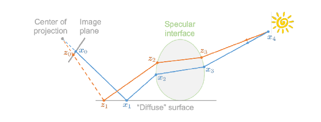
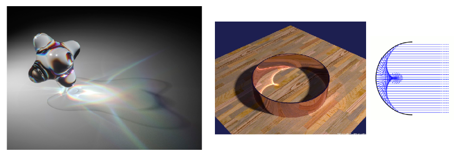
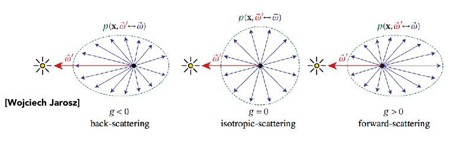
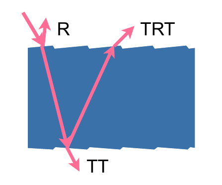
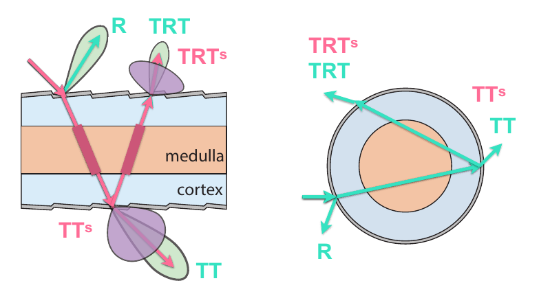
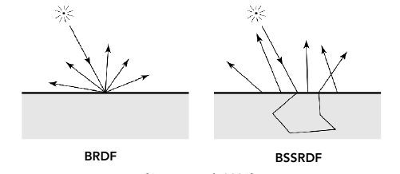
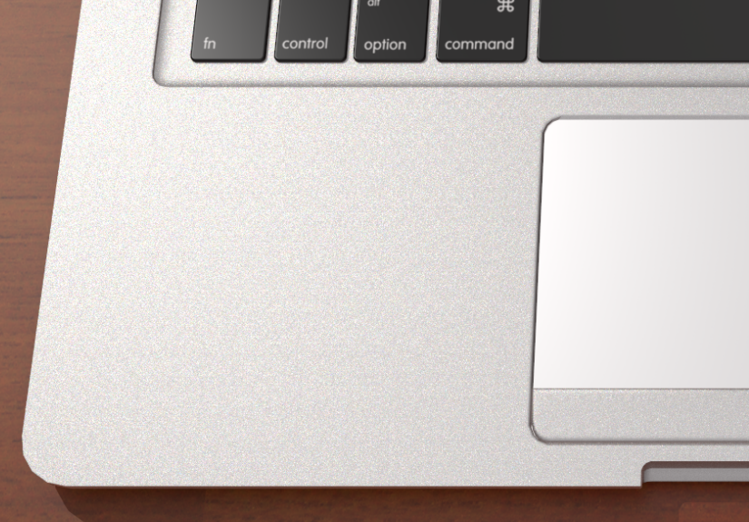

## Lecture 18 Materials and Appearances

**高级光线传播**

若蒙特卡洛方法求得的定积分的期望值与真实期望一样, 我们就称估计是无偏的, 如果估计是有偏的, 但是当采样点足够多时期望可以收敛到正确值我们就称估计是一致的. 常见路径追踪方法有

- 无偏光线传播

  - 双向路径追踪Bidirectional path tracing(BDPT): 分别从光源与摄像机发出光, 同时投射, 称这样的光线为半路径, 两个半路径连起来就是一条光路. 双向路线追踪对于大片被间接光照亮的的场景效果很好(因为直接从光源开始追踪)

  - Metropolis光线传播Metropolis Light Transport(MLT): 使用马尔科夫链进行采样(根据一个样本获得与之相近的样本). 可以根据一条路径生成周围的路径. 该方式特别适合做复杂反射的光路传播. 缺点是很难分析算法收敛时间

    

- 有偏光线传播

  - 光子映射(Photon Mapping): 适合渲染光经过光学面聚焦后的结果与复杂路径

    

    一种实现方法: 

    1. 从光源出发追踪光子, 光子打倒漫反射面就不动了, 让光子都停到漫反射面上
    2. 从照相机出发追踪光子, 光子打倒漫反射面就不动了, 让光子都停到漫反射面上
    3. 计算局部的密度估计(给一个点, 求周围N个光子), 可以用$N$的范围度量我们可以看到什么

  - VCM: 光子映射+双向路径追踪, 在双向路径追踪时候若两个点在同一面上且离得足够近, 我们就认为这两个半路径相交

- 实时辐射度Instant Radiosity (IR)

  认为已经被照亮的地方是光源, 将光源直射到的地方当作新光源并取代原光源. 优点: 快, 缺点: 接缝处会出现小光点

虽然这些方法很高端, 但是路径追踪还是最准确的

**外观建模**

- 非表面模型

  - 散射介质: 光在行进的过程中会发生散射/汇聚. 如: 雾, 云

    使用Phase Function定义散射方式

    

    渲染方法: 光在任何地方方向都可能发生改变, 产生不同Path尝试折到光源

  - 头发与毛发: 研究光与曲线如何作用, 毛发有无色的高光与有色的高光

    将毛发认为是玻璃壳包裹的色素柱, 柱表面有单向锯齿. 光有三种行进方式

    

    动物毛发与人头发相比, 髓质更大, 光更容易发生散射. 得到改进后的圆柱模型(在色素中包入髓质圆柱面)

    

  - 颗粒材质Granular Material

    渲染小石子, 沙粒用

- 表面模型

  - 半透明材质Translucent Material

    渲染玉石, 人体(半透光的部位), 考虑了光打入物体后发生散射最后从其他部位射出, 使用BSSRDF函数取代BRDF函数表示从某个方向射入从其他地方射出的光分布

    

  - 布料

  - 细节度模型

    我们渲染出的物体都太完美了, 现实中的物体表面或多或少都有一些划痕与缺陷, 可以定义一些贴图让其有瑕疵. 我们的模型也没有考虑光的波动性, 没有考虑光的干涉(如金属表面不仅可以看到金属颜色, 还可以看到一些因为干涉产生的亮点)

    

- 程序化生成模型

  用函数动态生成外观(三维纹理)
