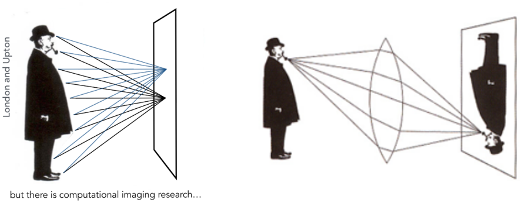
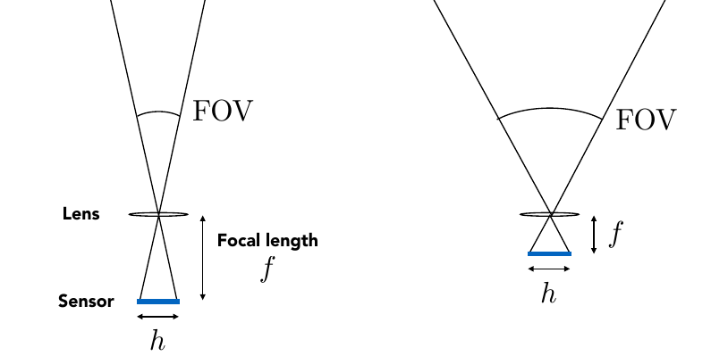
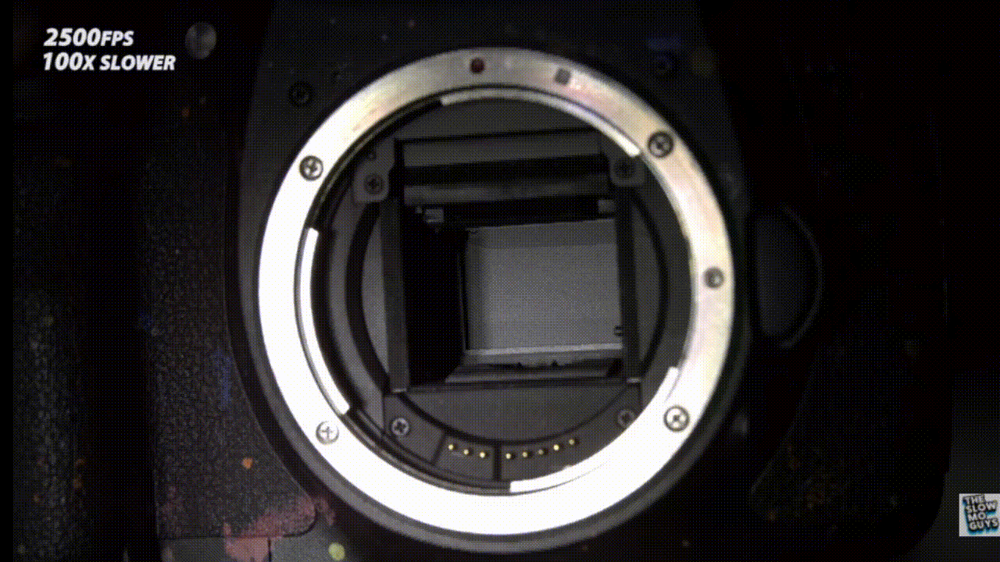
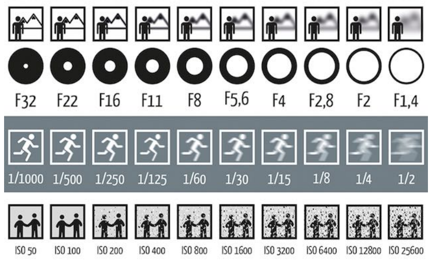
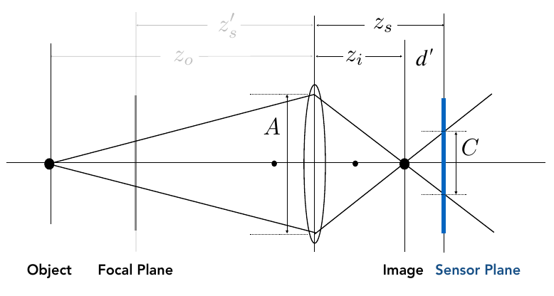
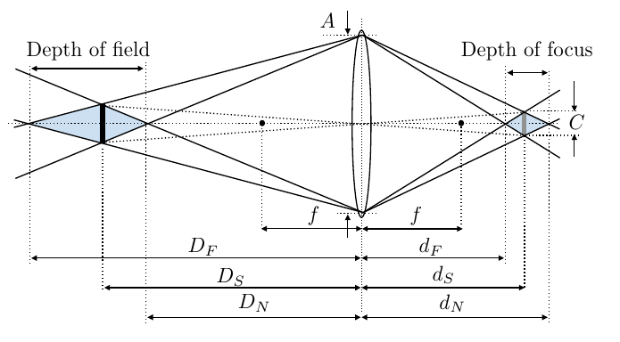

## Lecture 19 Cameras Lenses

在此之前图像都是通过计算机合成的, 实际上, 我们还可以通过相机直接合成图像

相机成像模式: 小孔成像相机(Pinhole)与镜头传感器成像(Lenses Form Image on Sensor)

**小孔成像相机**

应用小孔成像原理, 没有像素大小与焦距限制, 每个点都是清晰的没有深度可言

**镜头-传感器相机**

相机的感光元件是传感器(Sensor Accumulates Irradiance During Exposure), 其记录的是Irradiance(各种方向的光)

为什么相机需要镜头呢? 因为传感器接受的是各种方向的Irradiance, 而不能接收特定方向的光, 我们需要一个透镜将不同来向的光汇聚在不同地方

摄像机镜头并非是一个薄透镜, 而是一个薄透镜组, 相机可以通过调整透镜组之间距离实现整体变焦. 通过变换焦距可以调整相机的视场. 镜头传感器相机的评价指标有: 视场(Field of View/FOV), 传感器尺寸(Sensor Size), 曝光(Exposure), 光圈(Aperture), 快门速度(Shutter), 感光度(Gain/ISO), 

**视场(Field of View/FOV)**

表示可以看到多远的范围(与透视投影那块差不多)
$$
FOV = 2\arctan\left(\frac{h}{2f}\right)
$$
其中$h$是传感器高度(一般不用宽度表示FOV), $f$是焦距(Focal Length)

FOV由两个参数决定, 我们规定, 市面上的镜头$f$应该为相机等效35mm胶片的$f$

FOV大成像宽广, FOV小成像窄远

**传感器尺寸(Sensor Size)**

传感器尺寸越大分辨率越大

**曝光度(Exposure)**

$H=T\times E$, 即曝光度是Irradiance(E)在Exposure Time(T)上的积分

- Exposure Time由快门速度决定
- Irradiance由进光功率与光圈, ISO决定

**光圈, 快门速度, 感光度**

- 光圈是仿照人体瞳孔设计的, 决定进光量, 用f-stop表示

- 快门可以理解为传感器外面的帘子, 在成像时帘子放下, 然后在规定时间后在放下. 快门速度表示传感器感光时间

  

- 感光度(ISO)可以认为是对图像的后期处理, 将相机会将接收到的光$\times ISO$倍

不同光圈, 快门速度, 感光度

- ISO表示像素增益倍数, **ISO越大, 图像越亮**, ISO在放大图像的过程中也会放大噪声, 所以**ISO过大会出现噪点**. ISO是线性的, 也就是说ISO400一定比ISO200亮一倍

- 快门速度用秒表示, **快门时间长会造成运动模糊**. 机械式快门是一个帘子, 其遮挡传感器需要时间, 所以各个传感器开始感光的时刻不同, 这会造成如下图螺旋桨的果冻效应(Rolling Shutter)

  

- 光圈用f-stop表示, $f-stop = f/d$(即焦距/光圈直径), **数字越小, 光圈越大, 透光量越大, 景深越浅, 远处成像越模糊**

**薄透镜近似假设**

- 进入透镜的所有平行光线都通过其焦点
- 通过一个焦点的所有光线在通过透镜后将是平行的
- 焦距可以任意改变(通过透镜组)
- 对于焦距$f$, 物距$z_0$, 像距$z_i$有$\frac{1}{f}=\frac{1}{z_i}+\frac{1}{z_0}$

**失焦模糊(Deforce Blur)**

当一系列三维物体在感光器件Sensor Plane上成像时, 我们可以利用光路可逆性推出在感光器件上完美成像的物距. 该物距对应的平面为Focal Plane. 不在该平面上成像的物体则会在感光元件上投射出模糊的像

如图, 蓝色感光平面距离透镜$z_s$, 完美成像平面距离透镜$z_s'$, 然而小圆点距离透镜$z_0$, 导致光线在$z_i$处聚焦后再次投射, 最后在感光平面上投出一个直径为$C$的圆, 我们称这个圆为弥散圆(Circle of Confusion/CoC). 利用相似三角形可以得到弥散圆直径$C=\frac{d'}{z_i}A = \frac{\|z_s-z_i\|}{z_i}A=\frac{\|z_s-z_i\|}{z_i}\frac{f}{N}$

可以看到, 弥散圆的直径与$z_i, z_s, f, N$有关, $z_i$与$z_0, f$有关, 而$f, z_s$是定值, 所以$C$只与物距$z_0$, 光圈直径$N$有关, 当光圈f-stop变小, 光圈直径$N$变大, 非Focal Plane上的物体成像就越模糊

**计算机模拟镜头-传感器相机拍照**

计算机也可以模拟出失焦模糊的效果

将成像面作为感光平面, 在成像平面选择一个点将该点与透镜中心连线, 计算得到对应Focal Plane上的点

**景深(Depth of Field)**

我们认为当CoC足够小时(例如小于一个像素尺寸)成像就是清晰的, 对于一次成像, 将CoC足够小时对应的物距范围长度称为景深

