## Lecture 20 Light Fields, Color and Perception

**光场Light Fields/Lumigraph**

我们希望构造一个函数表示从固定点在不同角度能看到的东西

- Grayscale snapshot定义了人在球坐标系中心想不同方向看的光强度$P(\theta, \Phi)$, 只有光照强度, 我们看到的是灰度图

  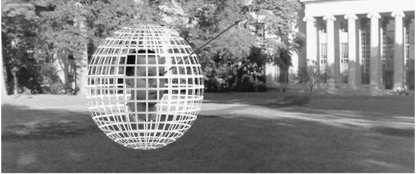

- Color snapshot定义了人在球坐标系中心想不同方向看的不同波长光强度$P(\theta, \Phi,\lambda)$, 不同波长的光对应了不同的颜色, 我们看到的是彩色图

  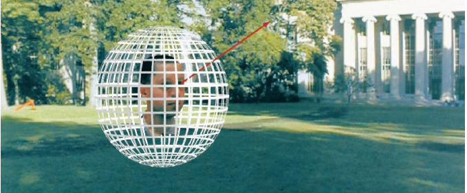

- 还可以为Color snapshot加上时间维度$P(\theta, \Phi,\lambda, t)$

- 全光函数定义了场景中每个点从不同时间角度看到的颜色强度$P(\theta, \Phi,\lambda, t, V_X, V_Y, V_Z)$

  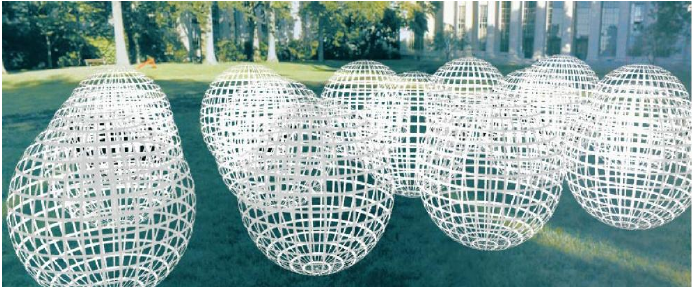

有了全光函数, 我们就知道摄影机在任何时间, 任何地点, 任何方向看到的颜色了. 换而言之, 全光函数是我们在显示器上渲染整个场景需要的唯一信息. 但是信息似乎有点多了.  

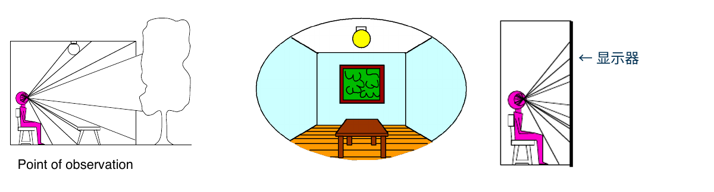

我们定义一个平面, 记录从这个平面每个点发出的不同方向的光, 定义其为光场函数($P(x,y,\theta,\Phi)$). 光场函数记录了平面上每个点在每个方向观测的颜色. 如果把这个平面当成显示器, 我们就得到了从不同角度观察显示器上点的结果

然而, $P(x,y,\theta,\Phi)$的定义并不方便我们使用, 每次渲染时我们都要计算用户看到屏幕上点仰角. 可以在光场平面后再加入一个辅助平面, 定义一个方向为辅助平面上的点$(u,v)$与光场面上的点$(x,y)$连线的方向

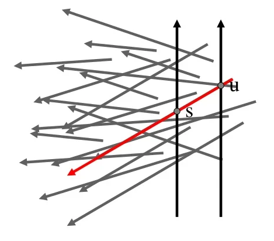

将不同维度作为坐标轴, 我们可以得到不同的图像(上图中每个小图是从一个固定点看光场平面的成像, 下图的小图是一个固定的光场平面上的点被不同是$(u,v)$看到的样子)

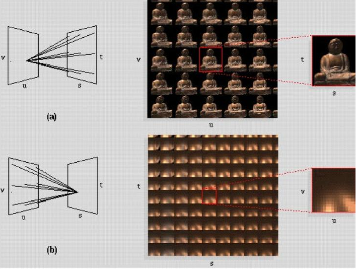

**光场摄像机**

普通摄像机感光元件上一个基本单位(像素)接收到的是不同方向光的总和. 其记录的是摄像机在某个位置, 某个方向的成像. 

光场摄像机模拟了苍蝇的复眼, 在感光元件的每个基本单位("像素")前方放了一个透镜, 该透镜可以将不同来向的光分散的打在这个感光元件上, 感光元件分别记录该像素上不同来向的光强度. 我们可以获取同一来向的光在感光元件上的强度, 每个方向的成像就相当于是一个普通相机拍的一张照片. 这样一次拍摄就记录了一个平面上每个点收到不同方向的光, 相当于记录了一个光场函数

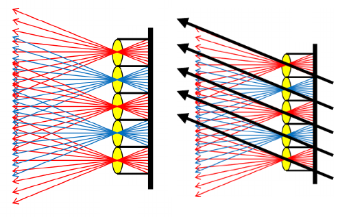

优点: 

- 记录了同一位置的不同方向光照
- 可以随时在拍照结束后随时更换焦距

缺点: 

- 分辨率不足, 毕竟一个透镜只对应一个像素, 透镜后需要很多感光元件分别记录不同方向来光
- 透镜难造

**颜色与感知(Color and Perception)**

不同颜色的光对应不同的波长. 不同的光还可以叠加产生新的光, 使用谱功率密度(Spectral Power Distribution, SPD)定义一个光在不同波长上的功率分布(下图是日光与LED光的SPD图)

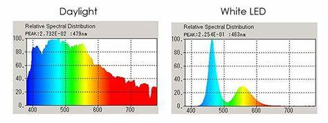

SPD支持线性加和, 两个光的叠加就是两个光SPD的叠加(即: 光线是加色系统)

**人眼感知光线的方式**: 与相机成像类似, 光线通过瞳孔(光圈)射入人眼, 通过晶状体(薄透镜)发生折射, 打在视网膜(感光元件)上. 视网膜上分布着感知光线强度的柱状细胞(Rod Cells)与感知颜色的锥形细胞(Cone Cells). 锥形细胞分为三种细胞: S-Cone, M-Cone, L-Cone. 三种细胞分别对三种不同范围波长的光敏感度不同, 

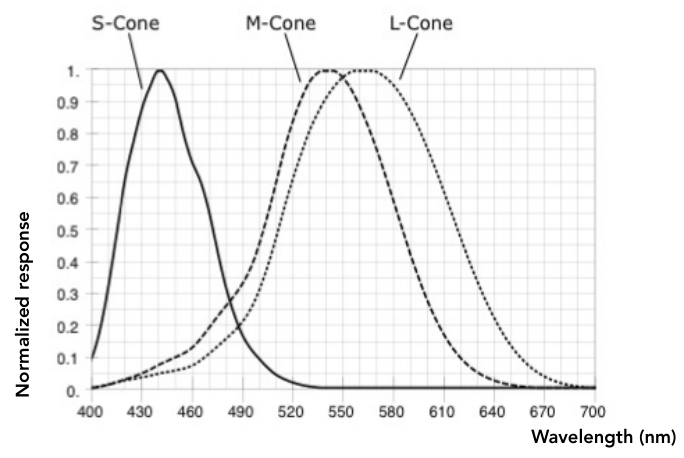

人类感知颜色的结果就是三种细胞分别计算敏感度对感应强度的积分得到的三元组$(S,M,L)$.(p.s. 不同人眼中三种细胞数量分布差异很大, 所以理论上不同人看到的颜色其实是不同的) 理论上, 对于不同SPD的光, 只要细胞计算出$(S,M,L)$一样, 人眼感知到的颜色就是一样的. 这种现象成为**同色异谱**(下面的光SPD不同, 但是三种细胞各自算出的积分是一样的)

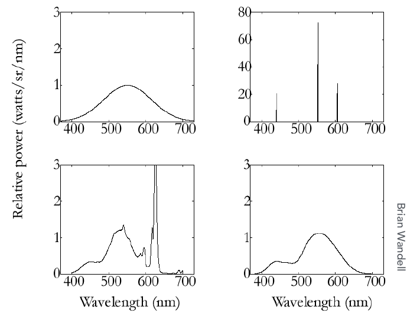

在显示时, 我们很难模拟自然界的任意光线(如上图中左上子图连续的SPD), 但是我们可以利用同色异谱现象, 仅仅用三个波长的光(如上图中右上子图)模拟出相同的$(S,M,L)$

**颜色匹配函数**

颜色匹配函数告诉我们描述波长为$x$的光, 需要多少的预定义的特定光组合起来. 例如CIE-RGB色彩系统使用三种特定波长的红绿蓝光描述一定波长范围的光. 其颜色匹配函数如下

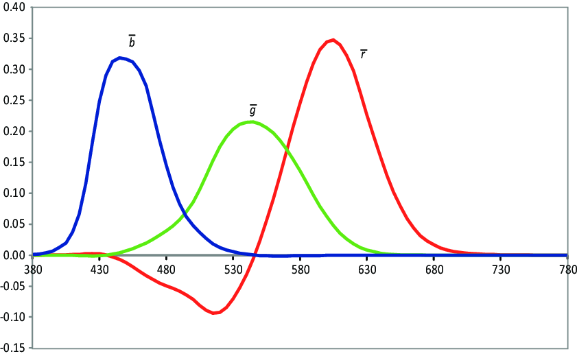

注意到在一段波长区间, 绿色与红色的需求倍数是小于0的, 这表示我们无法用RGB表示这个颜色, 假设一个颜色的RGB表示是$(-0.1, 0.1, 0.1)$, 其说明我们无法表示这个光, 但是这个光与$(0.1,0,0)$光混合后, 我们可以用$(0,0.1,0.1)$表示

**颜色空间与色域**

- CIE-XYZ系统[科研常用]

  CIE-XYZ是一套人造颜色匹配系统. XYZ是三种波长的预定义光. 但这三种光并不代表特定颜色. 可以通过XYZ的非负线性组合表述可见光. 同时, Y光一定程度上代表了颜色的亮度. 

  我们希望将XYZ可以表示的颜色(即: 色域)可视化展现出来, 但是XYZ是三个颜色, 可以先将XYZ归一化, 得到$x = \frac{X}{X+Y+Z}, y = \frac{Y}{X+Y+Z}$, 这样$z = 1-x-y$就可以不用再在坐标系中表示了, 由于Y表示亮度, 我们可以让Y为定值, 仅变换$X,Y$获得$x,y$. 最后为$(x,y)$着上其表述的颜色即可

  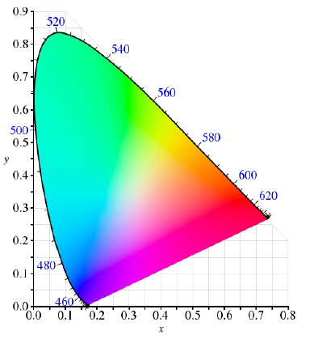

  在色域中间可以看到白色(因为白色是所有颜色的混合), 在色域边缘可以看到纯色

- 标准RGB系统(RGB/sRGB)[很常用]

  预定义了特定波长的标准红绿蓝, 其他颜色都用它表示. 但是sRGB有一部分颜色是表示不了的(颜色匹配函数中小于0的部分), 其只能表述XYZ颜色空间中一个三角形的部分

  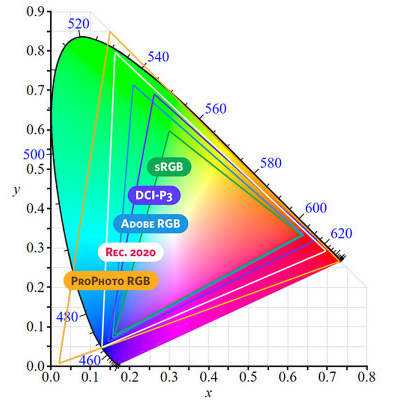

- HSV/HSL颜色空间[艺术家常用]

  使用色调(Hue, 颜色在色环上的角度)-饱和度(Saturation, 描述颜色更接近混合颜色(白色)还是纯色)-明度(Value/Lightness)定义颜色

  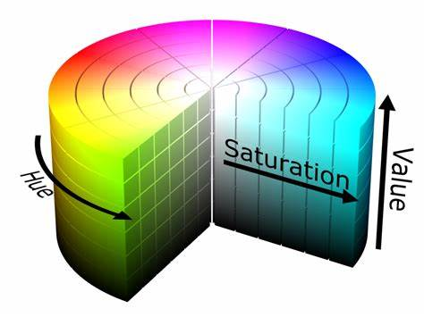

- LAB色彩空间

  定义$L$轴两端是黑白, $a$轴两端是红绿, $b$轴两段是黄蓝, 其他颜色就是他们的组合. LAB色彩空间认为空间两端的颜色都是互补色(黑-白, 红-绿...)

  如果产生两种颜色的光波相混合，结果出现灰色，则两种颜色互补. 人脑认为两个颜色差异过大时就认为他们是互补的(例如很容易想象出黄绿, 蓝绿色, 但是很难想象出红绿色)

  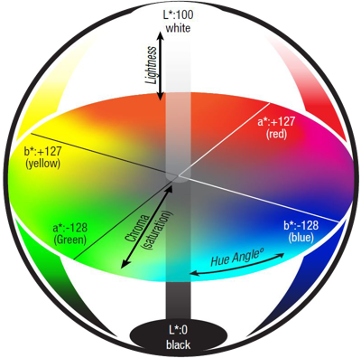

  还有一些与互补色相关的视觉错觉: 人如果盯一个颜色时间就了, 忽然切换到其他颜色, 人脑就会脑补出这个颜色的互补色([拮抗理论](https://www.verywellmind.com/what-is-the-opponent-process-theory-of-color-vision-2795830))

- CMYK系统

  前面的颜色系统都是加色系统(颜色混合得到白色), 但是现实中印刷等是一个减色系统(颜色混合得到黑色). CMYK是一个减色系统, 定义C(青)M(洋红/品红)Y(黄)K(黑)四种墨水的比例定义颜色. 其混合如下图

  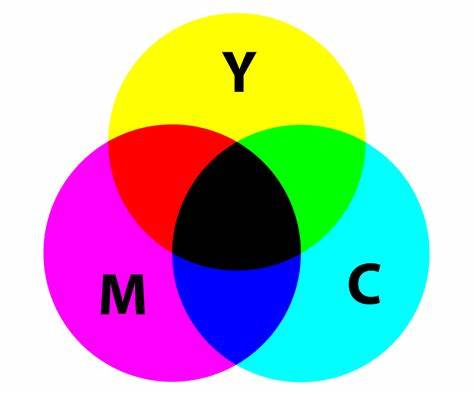

  注意到: 通过混合CMY就可以得到黑色K, 但是我们还是要定义K, 而不是在印刷中直接用CMY混合得到K. 这是因为K墨水最便宜, 而CMY墨水造价高...

