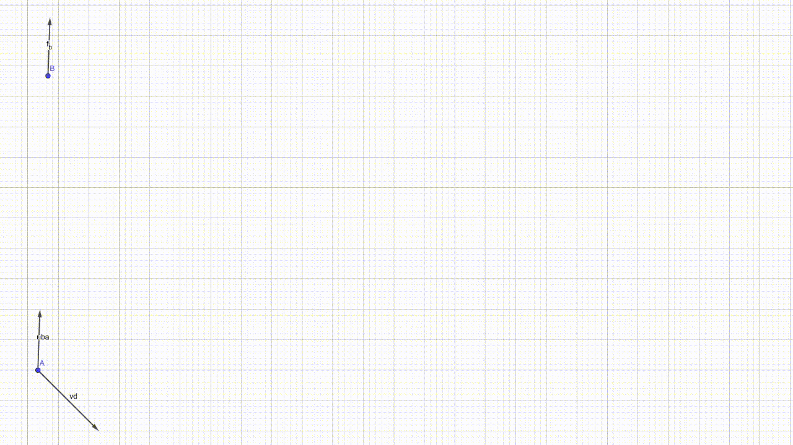
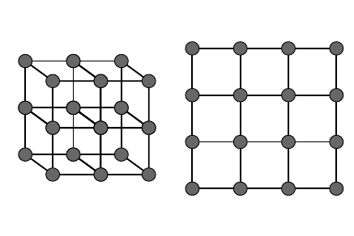
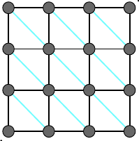
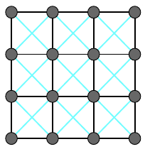
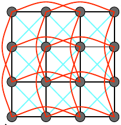
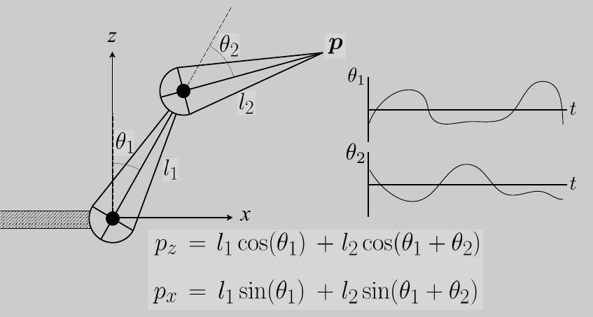
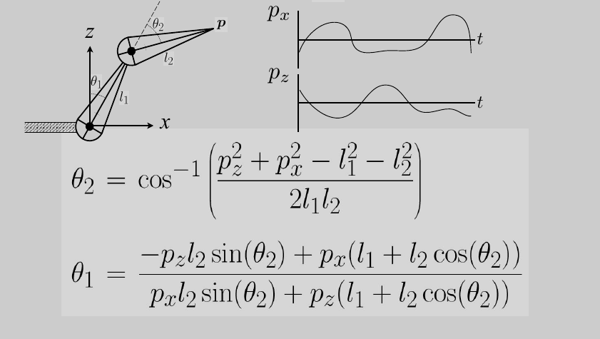

## Lecture 21 Animation

动画实现方式: 关键帧动画, 物理模拟

**质点弹簧系统(Mass Spring Rope)**

就是一系列相互连接的质点和弹簧. 

弹簧系统中, 端点两边物体的相互作用力与形变长度正比即: 
$$
f_{a\to b} = -f_{b\to a} =  k_s\frac{b-a}{\|b-a\|}(\|b-a\|-l)
$$
$l$为自然展开长度, $a,b$为两个质点向量. 

在模拟中, 我们用$\dot{y}$表示$y$的一阶导数, 用$\ddot{y}$表示$y$的二阶导数...

将弹簧拉开后, 根据能量守恒, 弹簧会永远运动. 为了让物体停下来, 我们要为引入摩擦力$f=-k_d\dot{b}$($b$为速度, $k_d$为常数). 这样引入摩擦力会导致弹簧整体运动时出现额外的摩擦力(弹簧两端相对静止, 整体在光滑的水平面上运动, 会发现弹簧会越来越慢). 考虑到这个问题, 引入相对速度(用$a$到$b$连线点乘相对运动运动向量相当于获得了相对运动向量在$\vec{ab}$上的投影, 然后再换成向量)
$$
f_b = -k_d\frac{b-a}{\|b-a\|}(\dot{b}-\dot{a})\frac{b-a}{\|b-a\|}
$$

弹簧之间还可以组合成不同的形状: 

用这些简单图形无法表示各式各样的材质

- 让平面结构抗切变

  拉着上图平面结构的左下与右上角, 这个网会更容易被拉歪, 即两边的节点向斜对角线汇聚. 我们需要增加弹簧抗拒切变

  

  此时再拉住左下右上, 蓝色的弹簧会抗拒压缩

  当然, 还应该给另一半对角线加入弹簧防止发生另一个方向的切变

  

- 让平面抗弯曲

  在抗切边基础上, 平面结构很容易沿着正方形边折叠, 可以在相隔顶点之间建立弹簧

  

**粒子系统(Particle Systems)**

定义了一堆微小的粒子, 然后一个一个建模, 分析每个粒子受力(粒子间作用与受到的外力)

**运动学**

给定一个模型的每个组件如何运动, 求解每个组件的位置

定义模型的骨骼系统有三种关节

- Pin: 将一个钉子钉在骨骼之间, 这样两个骨骼可以在所成二维平面内旋转
- Ball: 骨骼一段包在骨骼另一端, 这样骨骼就可以已连接端为球心旋转
- Prismatic Joint: 可以认为是两个骨骼之间有一个可以拉伸的物件连接

例如: 已知两个关节是Pin链接, 给出$\theta_1,\theta_2$变化函数求$t$时刻时$P$点的位置

**逆运动学**是给出组件某个点的位置, 求解每个组件是如何变换的(还有多解与无解可能)

例如: 已知两个关节是Pin链接, 给出$t$时刻时$P$点的位置, 求$\theta_1,\theta_2$变化函数

一运动学一般用优化方法求解, 而不是用数学方法求解

**Rigging**

通过控制线为骨骼添加动作/做造型(类似于提线木偶)

**动作捕捉**

让角色穿上有控制点的衣服, 相机捕捉到控制点就实现了动作捕捉
