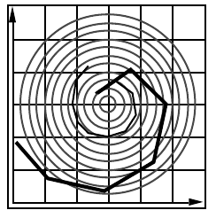
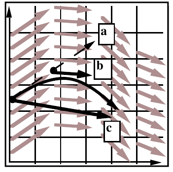
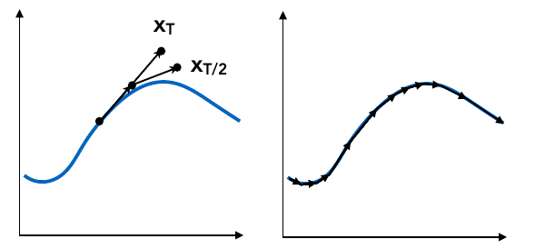

## Lecture 22 Animation and Simulation

**单粒子模拟(Single particle simulation)**

已知一个物体初始时的起点和速度, 很容易得到该物体在下一时刻的位置. 我们想要模拟一个粒子在速度场($v(x,t)$)的运动轨迹

可以用微分方程计算表述$\dot{x} = v(x,t)$, 希望得到位置关于时间的函数$x(t)$, 假设初始位置为$x_0$

- 可以采用欧拉方法解微分方程

    $$
    x^{t+\Delta t}=x^{t}+\Delta t\dot{x}^{t}\\
    \dot{x}^{t+\Delta t}=\dot{x}^{t}+\Delta t\ddot{x}^{t}
    $$

    但是效果不怎么好($\Delta t$不够小), **不稳定**(可能会偏离速度场)

    

- 可以采用中点法改进欧拉方法

    如图, 从$o$点出发, 先走$\Delta t$步, 到达$a$点, 取$oa$中点$b$, 获取$b$点速度, 重新从原点走$\Delta t$步, 速度取$b$点速度

    

    B点: $x_b = x(t)+\Delta t\ v(x(t),t)/2 $

    C点: $x_c = x(t)+\Delta t\ v(x_B,t) $

    联立方程
    $$
    x^{t+\Delta t} = x^t+\Delta t \dot{x}^t+\frac{(\Delta t)^2}{2}\ddot{x}^t
    $$

- 可以采用自适应改变步长法改进欧拉方法

    如图, 从$o$点出发, 先走$\Delta T$步, 到达$x_T$点, 再从$o$点出发, 走两次$\Delta T/2$步, 到达$x_{T/2}$. 计算$\|x_t-x_{T/2}\|$, 如果误差过大, 就将$\Delta T$减半, 继续迭代. 这样在不同位置我们可以选用不同的$\Delta T$计算

    

- 可以采用隐式欧拉方法(后向的方法)

    之前欧拉方法估算$t+\Delta t$时刻位置时使用的是$t$时刻的速度, 隐式欧拉方法使用下一时刻的速度估算
    $$
    x^{t+\Delta t}=x^{t}+\Delta t\dot{x}^{t +\Delta t}\\
    \dot{x}^{t+\Delta t}=\dot{x}^{t}+\Delta t\ddot{x}^{t+\Delta t}
    $$
    方程不好解(需要使用优化方法估算下一个点的速度&加速度), 但是好用又稳定:)

    隐式欧拉误差是一阶的(局部误差$O(h^2)$, 全局误差$O(h)$, $h$为步长(如本例中$\Delta t$))

- 可以采用Runge-Kutta方法改进欧拉方法

    一类方法, 特别擅长解非线性常微分方程. 其中RK4方法是一个4阶方法, 对于如下方程
    $$
    \frac{dy}{dx}=f(t,y)\\
    y(t_0)=y_0
    $$
    RK4先定义
    $$
    t_{n+1}=t_n+h\\
    y_{n+1}= y_n+\frac{1}{6}h(K_1+2K_2+2K_3+K_4)
    $$
    即下一次位置是上一次加上步长加上一个奇怪的值(相当于坐了一个双向的均值)
    $$
    k_1=f(t_n,y_n)\\
    k_2=f(t_n+h/2,y_n+hk_1/2)\\
    k_3=f(t_n+h/2,y_n+hk_2/2)\\
    k_4=f(t_n+h,y_n+hk_3)\\
    $$

- 采用非物理方法

    通过设置一系列限制不断要求修正位置, 唯一缺点就是不符合物理规律

p.s. 如何定义数值方法稳定性

- 稳定性: 度量每一步的误差(截断误差),整体误差与阶($\Delta t$)的关系. 
- 误差为$O(h^n)$说明$h$每减小一半, 局部误差减少到$1/{2^n}$

**刚体模拟(Rigid Body Simulation)**

刚体不会发生形变, 刚体运动会要求内部的点以同样的方式运动. 可以把刚体想象成一个大粒子, 只不过在求刚体运动时候会给出更多限制
$$
\frac{d}{dt}\left(
\begin{matrix}
X\\ \theta\\\dot{X}\\\omega
\end{matrix}
\right)=\left(
\begin{matrix}
\dot{X}\\ \omega\\a\\\alpha
\end{matrix}
\right)
$$
$\alpha$为角加速度, $a$为加速度

**流体模拟**

**后续学习路线**

- 信号系统
- 数值分析

